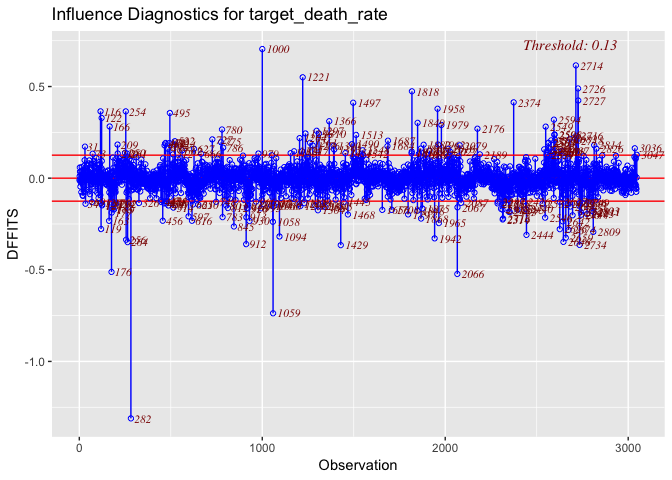
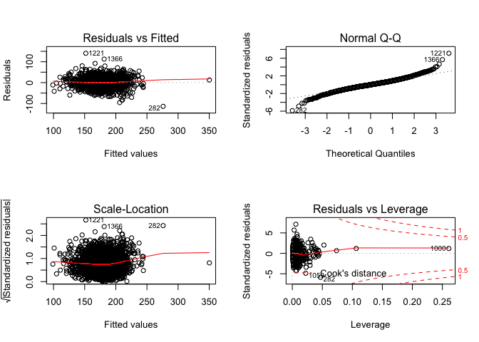
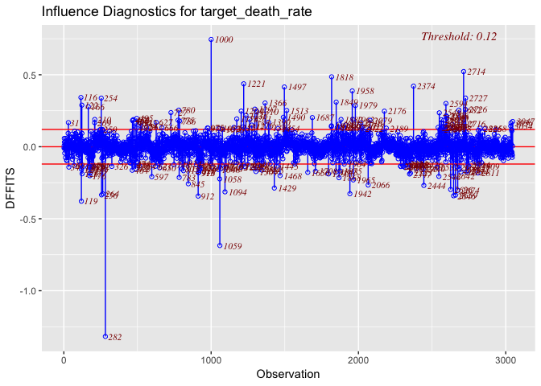

Diagnosis and Validation
================
Xue Yang
12/11/2018

``` r
cancer_df =
  read_csv("Cancer_Registry.csv") %>% 
  janitor::clean_names()
```

    ## Parsed with column specification:
    ## cols(
    ##   .default = col_double(),
    ##   avgDeathsPerYear = col_integer(),
    ##   medIncome = col_integer(),
    ##   popEst2015 = col_integer(),
    ##   binnedInc = col_character(),
    ##   Geography = col_character()
    ## )

    ## See spec(...) for full column specifications.

``` r
raw_data =
  cancer_df %>%
  dplyr::select(-pct_employed16_over, - pct_private_coverage_alone, -binned_inc) %>% 
  dplyr::select(-geography, -avg_deaths_per_year, -pop_est2015, -pct_no_hs18_24 , -pct_hs18_24 , -pct_bach_deg18_24, -pct_some_col18_24, -median_age, -pct_private_coverage, -pct_public_coverage, -pct_public_coverage_alone, -percent_married , -birth_rate) %>% 
  dplyr::select(target_death_rate, everything()) 
```

Diagnosis
---------

### Model 1

Through stepwise: we build a model with 11 variables

``` r
fit1 = lm(target_death_rate ~ avg_ann_count + incidence_rate + 
    poverty_percent + median_age_female + pct_hs25_over + pct_bach_deg25_over + 
    pct_unemployed16_over + pct_white + pct_black + pct_other_race + 
    pct_married_households, data = raw_data)
summary(fit1)
```

    ## 
    ## Call:
    ## lm(formula = target_death_rate ~ avg_ann_count + incidence_rate + 
    ##     poverty_percent + median_age_female + pct_hs25_over + pct_bach_deg25_over + 
    ##     pct_unemployed16_over + pct_white + pct_black + pct_other_race + 
    ##     pct_married_households, data = raw_data)
    ## 
    ## Residuals:
    ##      Min       1Q   Median       3Q      Max 
    ## -113.855  -11.308   -0.144   11.205  140.652 
    ## 
    ## Coefficients:
    ##                          Estimate Std. Error t value Pr(>|t|)    
    ## (Intercept)             1.128e+02  9.782e+00  11.527  < 2e-16 ***
    ## avg_ann_count          -5.983e-04  2.816e-04  -2.124 0.033711 *  
    ## incidence_rate          1.980e-01  7.070e-03  28.010  < 2e-16 ***
    ## poverty_percent         6.236e-01  1.026e-01   6.077 1.38e-09 ***
    ## median_age_female      -2.350e-01  7.862e-02  -2.989 0.002821 ** 
    ## pct_hs25_over           4.897e-01  9.060e-02   5.405 6.97e-08 ***
    ## pct_bach_deg25_over    -1.340e+00  1.345e-01  -9.961  < 2e-16 ***
    ## pct_unemployed16_over   7.023e-01  1.474e-01   4.766 1.97e-06 ***
    ## pct_white              -1.267e-01  4.952e-02  -2.559 0.010539 *  
    ## pct_black              -8.936e-02  5.021e-02  -1.780 0.075247 .  
    ## pct_other_race         -7.779e-01  1.250e-01  -6.223 5.55e-10 ***
    ## pct_married_households -2.913e-01  8.116e-02  -3.590 0.000336 ***
    ## ---
    ## Signif. codes:  0 '***' 0.001 '**' 0.01 '*' 0.05 '.' 0.1 ' ' 1
    ## 
    ## Residual standard error: 19.84 on 3035 degrees of freedom
    ## Multiple R-squared:  0.4906, Adjusted R-squared:  0.4887 
    ## F-statistic: 265.7 on 11 and 3035 DF,  p-value: < 2.2e-16

**outliers**

``` r
# Studentized deleted residuals
stu_res_1 = rstandard(fit1) 


# Rule of thumb cutoff -- 2.5 
outliers_y_1 = stu_res_1[abs(stu_res_1)>2.5] 
outliers_y_1 %>% 
  length()
```

    ## [1] 68

According to rule of thumb, any observation with absolute studentized residual (|ri|) greater than 2.5 may be considered as an outlier of Y. In this dataset we have 68 outliers in Y.

``` r
# Get hat matrix values  
state.hat_1 = hatvalues(fit1) 
state.hat_1[state.hat_1 > 0.2] # Cutoff = 0.2
```

    ##      1000 
    ## 0.2608039

``` r
state.hat_1[state.hat_1 > 0.5] # Cutoff = 0.5
```

    ## named numeric(0)

When we use cutoff=0.2, there is 1 leverages in the data, and when we use cutoff = 0.5, there is no leverage in the data. Which means that there 1 moderate leverages in the data, no high leverage in the data.

**influential observations**

``` r
# influential observations
inf_1 = influence.measures(fit1)

ols_plot_cooksd_chart(fit1)
```


``` r
ols_plot_dffits(fit1)
```



``` r
par(mfrow = c(2,2)) 
plot(fit1)
```

 Based on Cook's distance and DFFITS, number 282, 1000 and 1059 observations are potential influential observations in the dataset.

Based on the diagnostic plots depicted above, we can also treat the number 282, 1000 and 1059 observations as potential influential outliers.

``` r
# Remove potential outlier 282.
raw_1 = raw_data[-c(282,1000, 1059),] 

# Fit a LM model for raw_2 
mult.fit_1 = lm(target_death_rate ~ avg_ann_count + incidence_rate + 
    poverty_percent + median_age_female + pct_hs25_over + pct_bach_deg25_over + 
    pct_unemployed16_over + pct_white + pct_black + pct_other_race + 
    pct_married_households, data = raw_1)

# compare the model of these two
summary(fit1)
```

    ## 
    ## Call:
    ## lm(formula = target_death_rate ~ avg_ann_count + incidence_rate + 
    ##     poverty_percent + median_age_female + pct_hs25_over + pct_bach_deg25_over + 
    ##     pct_unemployed16_over + pct_white + pct_black + pct_other_race + 
    ##     pct_married_households, data = raw_data)
    ## 
    ## Residuals:
    ##      Min       1Q   Median       3Q      Max 
    ## -113.855  -11.308   -0.144   11.205  140.652 
    ## 
    ## Coefficients:
    ##                          Estimate Std. Error t value Pr(>|t|)    
    ## (Intercept)             1.128e+02  9.782e+00  11.527  < 2e-16 ***
    ## avg_ann_count          -5.983e-04  2.816e-04  -2.124 0.033711 *  
    ## incidence_rate          1.980e-01  7.070e-03  28.010  < 2e-16 ***
    ## poverty_percent         6.236e-01  1.026e-01   6.077 1.38e-09 ***
    ## median_age_female      -2.350e-01  7.862e-02  -2.989 0.002821 ** 
    ## pct_hs25_over           4.897e-01  9.060e-02   5.405 6.97e-08 ***
    ## pct_bach_deg25_over    -1.340e+00  1.345e-01  -9.961  < 2e-16 ***
    ## pct_unemployed16_over   7.023e-01  1.474e-01   4.766 1.97e-06 ***
    ## pct_white              -1.267e-01  4.952e-02  -2.559 0.010539 *  
    ## pct_black              -8.936e-02  5.021e-02  -1.780 0.075247 .  
    ## pct_other_race         -7.779e-01  1.250e-01  -6.223 5.55e-10 ***
    ## pct_married_households -2.913e-01  8.116e-02  -3.590 0.000336 ***
    ## ---
    ## Signif. codes:  0 '***' 0.001 '**' 0.01 '*' 0.05 '.' 0.1 ' ' 1
    ## 
    ## Residual standard error: 19.84 on 3035 degrees of freedom
    ## Multiple R-squared:  0.4906, Adjusted R-squared:  0.4887 
    ## F-statistic: 265.7 on 11 and 3035 DF,  p-value: < 2.2e-16

``` r
summary(mult.fit_1)
```

    ## 
    ## Call:
    ## lm(formula = target_death_rate ~ avg_ann_count + incidence_rate + 
    ##     poverty_percent + median_age_female + pct_hs25_over + pct_bach_deg25_over + 
    ##     pct_unemployed16_over + pct_white + pct_black + pct_other_race + 
    ##     pct_married_households, data = raw_1)
    ## 
    ## Residuals:
    ##     Min      1Q  Median      3Q     Max 
    ## -84.934 -11.274  -0.192  11.119 140.129 
    ## 
    ## Coefficients:
    ##                          Estimate Std. Error t value Pr(>|t|)    
    ## (Intercept)             1.078e+02  9.719e+00  11.093  < 2e-16 ***
    ## avg_ann_count          -8.984e-04  3.233e-04  -2.779 0.005486 ** 
    ## incidence_rate          2.060e-01  7.155e-03  28.788  < 2e-16 ***
    ## poverty_percent         6.564e-01  1.020e-01   6.434 1.44e-10 ***
    ## median_age_female      -2.673e-01  7.799e-02  -3.427 0.000618 ***
    ## pct_hs25_over           4.906e-01  8.993e-02   5.456 5.27e-08 ***
    ## pct_bach_deg25_over    -1.274e+00  1.337e-01  -9.527  < 2e-16 ***
    ## pct_unemployed16_over   7.676e-01  1.469e-01   5.226 1.85e-07 ***
    ## pct_white              -1.159e-01  4.911e-02  -2.361 0.018298 *  
    ## pct_black              -9.346e-02  4.975e-02  -1.879 0.060366 .  
    ## pct_other_race         -7.460e-01  1.239e-01  -6.020 1.95e-09 ***
    ## pct_married_households -2.897e-01  8.054e-02  -3.597 0.000327 ***
    ## ---
    ## Signif. codes:  0 '***' 0.001 '**' 0.01 '*' 0.05 '.' 0.1 ' ' 1
    ## 
    ## Residual standard error: 19.66 on 3032 degrees of freedom
    ## Multiple R-squared:  0.4994, Adjusted R-squared:  0.4976 
    ## F-statistic:   275 on 11 and 3032 DF,  p-value: < 2.2e-16

Comparing the model estimates with and without outliers, we have a few observations:

1.  All coefficients have changed, and some of changes are magnitude.

2.  The removal of cases 282, 1000 and 1059 doesn't changes the directionality of the coefficients.

3.  After removing case 282, the standard errors of the coefficients decrease (from 19.84 to 19.66), and the adjusted R square increase (from 0.4887 to 0.4976 ). It is understandable as we have removed an influential/outlier point.

Therefore, we might deal with influential points:

**Checking model assumptions**

Checking for the assumption after removing the outliers:

``` r
par(mfrow = c(2,2)) 
plot(mult.fit_1)
```


Based on the diagnostic plots depicted above, we can see that that the assumptions hold better when removing outliers.

### Model 2

Through Cp and adjusted R square criteria, we build model with 9 vairables:avg\_ann\_count, incidence\_rate, poverty\_percent, median\_age\_female, pct\_hs25\_over, pct\_bach\_deg25\_over, pct\_unemployed16\_over, pct\_other\_race, pct\_married\_households.

``` r
fit2 = lm(target_death_rate ~ avg_ann_count + incidence_rate + poverty_percent + median_age_female + pct_hs25_over + pct_bach_deg25_over + pct_unemployed16_over + pct_other_race + pct_married_households, data = raw_data)
summary(fit2)
```

    ## 
    ## Call:
    ## lm(formula = target_death_rate ~ avg_ann_count + incidence_rate + 
    ##     poverty_percent + median_age_female + pct_hs25_over + pct_bach_deg25_over + 
    ##     pct_unemployed16_over + pct_other_race + pct_married_households, 
    ##     data = raw_data)
    ## 
    ## Residuals:
    ##      Min       1Q   Median       3Q      Max 
    ## -114.139  -11.354   -0.354   11.046  141.058 
    ## 
    ## Coefficients:
    ##                          Estimate Std. Error t value Pr(>|t|)    
    ## (Intercept)             1.054e+02  9.202e+00  11.453  < 2e-16 ***
    ## avg_ann_count          -5.528e-04  2.813e-04  -1.965 0.049451 *  
    ## incidence_rate          1.960e-01  7.024e-03  27.908  < 2e-16 ***
    ## poverty_percent         6.354e-01  1.017e-01   6.245 4.83e-10 ***
    ## median_age_female      -2.851e-01  7.621e-02  -3.741 0.000187 ***
    ## pct_hs25_over           4.834e-01  9.059e-02   5.336 1.02e-07 ***
    ## pct_bach_deg25_over    -1.314e+00  1.342e-01  -9.788  < 2e-16 ***
    ## pct_unemployed16_over   7.821e-01  1.427e-01   5.479 4.62e-08 ***
    ## pct_other_race         -6.730e-01  1.174e-01  -5.731 1.10e-08 ***
    ## pct_married_households -3.349e-01  7.578e-02  -4.420 1.02e-05 ***
    ## ---
    ## Signif. codes:  0 '***' 0.001 '**' 0.01 '*' 0.05 '.' 0.1 ' ' 1
    ## 
    ## Residual standard error: 19.86 on 3037 degrees of freedom
    ## Multiple R-squared:  0.4895, Adjusted R-squared:  0.4879 
    ## F-statistic: 323.5 on 9 and 3037 DF,  p-value: < 2.2e-16

**outilers**

``` r
# Studentized deleted residuals
stu_res_2 = rstandard(fit2) 


# Rule of thumb cutoff -- 2.5 
outliers_y_2 = stu_res_2[abs(stu_res_2)>2.5] 
outliers_y_2 %>% 
  length()
```

    ## [1] 70

According to rule of thumb, any observation with absolute studentized residual (|ri|) greater than 2.5 may be considered as an outlier Y. In this dataset we have 70 outliers in Y.

``` r
# Get hat matrix values  
state.hat_2 = hatvalues(fit2) 
state.hat_2[state.hat_2 > 0.2] # Cutoff = 0.2
```

    ##      1000 
    ## 0.2604662

``` r
state.hat_2[state.hat_2 > 0.5] # Cutoff = 0.5
```

    ## named numeric(0)

When we use cutoff=0.2, there is 1 leverages in the data, and when we use cutoff = 0.5, there is no leverage in the data. Which means that there 1 moderate leverages in the data, no high leverage in the data.

**influential observations**

``` r
# influential observations
inf_2 = influence.measures(fit2)

ols_plot_cooksd_chart(fit2)
```


``` r
ols_plot_dffits(fit2)
```


``` r
par(mfrow = c(2,2)) 
plot(fit2)
```


Based on Cook's distance and DFFITS, there are many potential influential observations, but number 282, 1000 and 1059 observations are the most influential ones.

Based on the diagnostic plots depicted above, we can also treat the number 282, 1000 and 1059 observations as a potential influential outliers.

``` r
# Remove potential outlier 282,1000,1059.
raw_2 = raw_data[-c(282,1000,1059),] 

# Fit a LM model for raw_2 
mult.fit_2 = lm(target_death_rate ~ avg_ann_count + incidence_rate + poverty_percent + median_age_female + pct_hs25_over + pct_bach_deg25_over + pct_unemployed16_over + pct_other_race + pct_married_households, data = raw_2)

# compare the model of these two
summary(fit2)
```

    ## 
    ## Call:
    ## lm(formula = target_death_rate ~ avg_ann_count + incidence_rate + 
    ##     poverty_percent + median_age_female + pct_hs25_over + pct_bach_deg25_over + 
    ##     pct_unemployed16_over + pct_other_race + pct_married_households, 
    ##     data = raw_data)
    ## 
    ## Residuals:
    ##      Min       1Q   Median       3Q      Max 
    ## -114.139  -11.354   -0.354   11.046  141.058 
    ## 
    ## Coefficients:
    ##                          Estimate Std. Error t value Pr(>|t|)    
    ## (Intercept)             1.054e+02  9.202e+00  11.453  < 2e-16 ***
    ## avg_ann_count          -5.528e-04  2.813e-04  -1.965 0.049451 *  
    ## incidence_rate          1.960e-01  7.024e-03  27.908  < 2e-16 ***
    ## poverty_percent         6.354e-01  1.017e-01   6.245 4.83e-10 ***
    ## median_age_female      -2.851e-01  7.621e-02  -3.741 0.000187 ***
    ## pct_hs25_over           4.834e-01  9.059e-02   5.336 1.02e-07 ***
    ## pct_bach_deg25_over    -1.314e+00  1.342e-01  -9.788  < 2e-16 ***
    ## pct_unemployed16_over   7.821e-01  1.427e-01   5.479 4.62e-08 ***
    ## pct_other_race         -6.730e-01  1.174e-01  -5.731 1.10e-08 ***
    ## pct_married_households -3.349e-01  7.578e-02  -4.420 1.02e-05 ***
    ## ---
    ## Signif. codes:  0 '***' 0.001 '**' 0.01 '*' 0.05 '.' 0.1 ' ' 1
    ## 
    ## Residual standard error: 19.86 on 3037 degrees of freedom
    ## Multiple R-squared:  0.4895, Adjusted R-squared:  0.4879 
    ## F-statistic: 323.5 on 9 and 3037 DF,  p-value: < 2.2e-16

``` r
summary(mult.fit_2)
```

    ## 
    ## Call:
    ## lm(formula = target_death_rate ~ avg_ann_count + incidence_rate + 
    ##     poverty_percent + median_age_female + pct_hs25_over + pct_bach_deg25_over + 
    ##     pct_unemployed16_over + pct_other_race + pct_married_households, 
    ##     data = raw_2)
    ## 
    ## Residuals:
    ##     Min      1Q  Median      3Q     Max 
    ## -85.280 -11.291  -0.339  11.002 140.162 
    ## 
    ## Coefficients:
    ##                          Estimate Std. Error t value Pr(>|t|)    
    ## (Intercept)             1.005e+02  9.141e+00  10.995  < 2e-16 ***
    ## avg_ann_count          -8.525e-04  3.228e-04  -2.641  0.00832 ** 
    ## incidence_rate          2.040e-01  7.108e-03  28.707  < 2e-16 ***
    ## poverty_percent         6.628e-01  1.011e-01   6.557 6.44e-11 ***
    ## median_age_female      -3.117e-01  7.555e-02  -4.126 3.79e-05 ***
    ## pct_hs25_over           4.866e-01  8.992e-02   5.412 6.73e-08 ***
    ## pct_bach_deg25_over    -1.250e+00  1.334e-01  -9.370  < 2e-16 ***
    ## pct_unemployed16_over   8.330e-01  1.421e-01   5.862 5.07e-09 ***
    ## pct_other_race         -6.465e-01  1.164e-01  -5.556 3.01e-08 ***
    ## pct_married_households -3.196e-01  7.531e-02  -4.243 2.27e-05 ***
    ## ---
    ## Signif. codes:  0 '***' 0.001 '**' 0.01 '*' 0.05 '.' 0.1 ' ' 1
    ## 
    ## Residual standard error: 19.67 on 3034 degrees of freedom
    ## Multiple R-squared:  0.4985, Adjusted R-squared:  0.497 
    ## F-statistic: 335.1 on 9 and 3034 DF,  p-value: < 2.2e-16

Comparing the model estimates with and without outliers, we have a few observations:

1.  All coefficients have changed, and some of changes are magnitude.

2.  The removal of cases 282, 1000 and 1059 doesn't changes the directionality of the coefficients.

3.  After removing case 282, 1000 and 1059, the standard errors of the coefficients decrease (from 19.86 to 19.67), and the adjusted R square increase (from 0.4879 to 0.497 ). It is understandable as we have removed an influential/outlier point.

Therefore, we might deal with influential points:

**Checking model assumptions**

Checking for the assumption after removing the outliers:

``` r
par(mfrow = c(2,2)) 
plot(mult.fit_2)
```


Based on the diagnostic plots depicted above, we can see that that the assumptions hold better when removing outliers.

### Model 3

Through Cp and adjusted R square criteria, we build model with 10 vairables:avg\_ann\_count, incidence\_rate, med\_income, poverty\_percent, median\_age\_female, pct\_hs25\_over, pct\_bach\_deg25\_over,pct\_unemployed16\_over, pct\_other\_race, pct\_married\_households

``` r
fit3 = lm(target_death_rate ~ avg_ann_count + incidence_rate + med_income + poverty_percent + median_age_female + pct_hs25_over + pct_bach_deg25_over + pct_unemployed16_over + pct_other_race + pct_married_households, data = raw_data)
summary(fit3)
```

    ## 
    ## Call:
    ## lm(formula = target_death_rate ~ avg_ann_count + incidence_rate + 
    ##     med_income + poverty_percent + median_age_female + pct_hs25_over + 
    ##     pct_bach_deg25_over + pct_unemployed16_over + pct_other_race + 
    ##     pct_married_households, data = raw_data)
    ## 
    ## Residuals:
    ##      Min       1Q   Median       3Q      Max 
    ## -112.262  -11.268   -0.252   11.115  140.648 
    ## 
    ## Coefficients:
    ##                          Estimate Std. Error t value Pr(>|t|)    
    ## (Intercept)             9.843e+01  9.910e+00   9.933  < 2e-16 ***
    ## avg_ann_count          -6.052e-04  2.825e-04  -2.142  0.03227 *  
    ## incidence_rate          1.951e-01  7.039e-03  27.718  < 2e-16 ***
    ## med_income              1.232e-04  6.528e-05   1.888  0.05912 .  
    ## poverty_percent         7.807e-01  1.276e-01   6.121 1.05e-09 ***
    ## median_age_female      -2.399e-01  7.985e-02  -3.004  0.00268 ** 
    ## pct_hs25_over           4.949e-01  9.076e-02   5.453 5.35e-08 ***
    ## pct_bach_deg25_over    -1.401e+00  1.419e-01  -9.872  < 2e-16 ***
    ## pct_unemployed16_over   7.297e-01  1.453e-01   5.020 5.46e-07 ***
    ## pct_other_race         -6.890e-01  1.177e-01  -5.855 5.29e-09 ***
    ## pct_married_households -3.650e-01  7.740e-02  -4.716 2.52e-06 ***
    ## ---
    ## Signif. codes:  0 '***' 0.001 '**' 0.01 '*' 0.05 '.' 0.1 ' ' 1
    ## 
    ## Residual standard error: 19.85 on 3036 degrees of freedom
    ## Multiple R-squared:  0.4901, Adjusted R-squared:  0.4884 
    ## F-statistic: 291.8 on 10 and 3036 DF,  p-value: < 2.2e-16

**outliers**

``` r
# Studentized deleted residuals
stu_res_3 = rstandard(fit3) 


# Rule of thumb cutoff -- 2.5 
outliers_y_3 = stu_res_3[abs(stu_res_3)>2.5] 
outliers_y_3 %>% 
  length()
```

    ## [1] 69

According to rule of thumb, any observation with absolute studentized residual (|ri|) greater than 2.5 may be considered as an outlier Y. In this dataset we have 69 outliers in Y.

``` r
# Get hat matrix values  
state.hat_3 = hatvalues(fit3) 
state.hat_3[state.hat_3 > 0.2] # Cutoff = 0.2
```

    ##      1000 
    ## 0.2626842

``` r
state.hat_3[state.hat_3 > 0.5] # Cutoff = 0.5
```

    ## named numeric(0)

When we use cutoff=0.2, there is 1 leverages in the data, and when we use cutoff = 0.5, there is no leverage in the data. Which means that there 1 moderate leverages in the data, no high leverage in the data.

**influential observations**

``` r
# influential observations
inf_3 = influence.measures(fit3)

ols_plot_cooksd_chart(fit3)
```


``` r
ols_plot_dffits(fit3)
```



``` r
par(mfrow = c(2,2)) 
plot(fit3)
```


Based on Cook's distance and DFFITS, there are many potential influential observations, but number 282, 1000 and 1059 observations are the most influential ones.

Based on the diagnostic plots depicted above, we can also treat the number 282, 1000 ad 1059 observations as a potential influential outliers.

``` r
# Remove potential outlier 282.
raw_3 = raw_data[-c(282,1000,1059),] 

# Fit a LM model for raw_2 
mult.fit_3 =lm(target_death_rate ~ avg_ann_count + incidence_rate + med_income + poverty_percent + median_age_female + pct_hs25_over + pct_bach_deg25_over + pct_unemployed16_over + pct_other_race + pct_married_households, data = raw_3)

# compare the model of these two
summary(fit3)
```

    ## 
    ## Call:
    ## lm(formula = target_death_rate ~ avg_ann_count + incidence_rate + 
    ##     med_income + poverty_percent + median_age_female + pct_hs25_over + 
    ##     pct_bach_deg25_over + pct_unemployed16_over + pct_other_race + 
    ##     pct_married_households, data = raw_data)
    ## 
    ## Residuals:
    ##      Min       1Q   Median       3Q      Max 
    ## -112.262  -11.268   -0.252   11.115  140.648 
    ## 
    ## Coefficients:
    ##                          Estimate Std. Error t value Pr(>|t|)    
    ## (Intercept)             9.843e+01  9.910e+00   9.933  < 2e-16 ***
    ## avg_ann_count          -6.052e-04  2.825e-04  -2.142  0.03227 *  
    ## incidence_rate          1.951e-01  7.039e-03  27.718  < 2e-16 ***
    ## med_income              1.232e-04  6.528e-05   1.888  0.05912 .  
    ## poverty_percent         7.807e-01  1.276e-01   6.121 1.05e-09 ***
    ## median_age_female      -2.399e-01  7.985e-02  -3.004  0.00268 ** 
    ## pct_hs25_over           4.949e-01  9.076e-02   5.453 5.35e-08 ***
    ## pct_bach_deg25_over    -1.401e+00  1.419e-01  -9.872  < 2e-16 ***
    ## pct_unemployed16_over   7.297e-01  1.453e-01   5.020 5.46e-07 ***
    ## pct_other_race         -6.890e-01  1.177e-01  -5.855 5.29e-09 ***
    ## pct_married_households -3.650e-01  7.740e-02  -4.716 2.52e-06 ***
    ## ---
    ## Signif. codes:  0 '***' 0.001 '**' 0.01 '*' 0.05 '.' 0.1 ' ' 1
    ## 
    ## Residual standard error: 19.85 on 3036 degrees of freedom
    ## Multiple R-squared:  0.4901, Adjusted R-squared:  0.4884 
    ## F-statistic: 291.8 on 10 and 3036 DF,  p-value: < 2.2e-16

``` r
summary(mult.fit_3)
```

    ## 
    ## Call:
    ## lm(formula = target_death_rate ~ avg_ann_count + incidence_rate + 
    ##     med_income + poverty_percent + median_age_female + pct_hs25_over + 
    ##     pct_bach_deg25_over + pct_unemployed16_over + pct_other_race + 
    ##     pct_married_households, data = raw_3)
    ## 
    ## Residuals:
    ##     Min      1Q  Median      3Q     Max 
    ## -85.078 -11.277  -0.375  11.046 139.771 
    ## 
    ## Coefficients:
    ##                          Estimate Std. Error t value Pr(>|t|)    
    ## (Intercept)             9.403e+01  9.835e+00   9.561  < 2e-16 ***
    ## avg_ann_count          -9.160e-04  3.247e-04  -2.821 0.004817 ** 
    ## incidence_rate          2.031e-01  7.126e-03  28.498  < 2e-16 ***
    ## med_income              1.156e-04  6.485e-05   1.782 0.074841 .  
    ## poverty_percent         7.983e-01  1.265e-01   6.312 3.15e-10 ***
    ## median_age_female      -2.693e-01  7.919e-02  -3.401 0.000681 ***
    ## pct_hs25_over           4.975e-01  9.009e-02   5.522 3.63e-08 ***
    ## pct_bach_deg25_over    -1.331e+00  1.409e-01  -9.446  < 2e-16 ***
    ## pct_unemployed16_over   7.852e-01  1.446e-01   5.432 6.02e-08 ***
    ## pct_other_race         -6.614e-01  1.166e-01  -5.671 1.55e-08 ***
    ## pct_married_households -3.481e-01  7.697e-02  -4.523 6.33e-06 ***
    ## ---
    ## Signif. codes:  0 '***' 0.001 '**' 0.01 '*' 0.05 '.' 0.1 ' ' 1
    ## 
    ## Residual standard error: 19.66 on 3033 degrees of freedom
    ## Multiple R-squared:  0.499,  Adjusted R-squared:  0.4973 
    ## F-statistic: 302.1 on 10 and 3033 DF,  p-value: < 2.2e-16

``` r
table = broom::tidy(fit3)
table2 = broom::tidy(mult.fit_3)
tibble(
  term = table$term,
   estimate_with = table$estimate,
  estiamte_without = table2$estimate
    ) %>% 
   knitr::kable(digits = 3)
```

| term                     |  estimate\_with|  estiamte\_without|
|:-------------------------|---------------:|------------------:|
| (Intercept)              |          98.432|             94.030|
| avg\_ann\_count          |          -0.001|             -0.001|
| incidence\_rate          |           0.195|              0.203|
| med\_income              |           0.000|              0.000|
| poverty\_percent         |           0.781|              0.798|
| median\_age\_female      |          -0.240|             -0.269|
| pct\_hs25\_over          |           0.495|              0.498|
| pct\_bach\_deg25\_over   |          -1.401|             -1.331|
| pct\_unemployed16\_over  |           0.730|              0.785|
| pct\_other\_race         |          -0.689|             -0.661|
| pct\_married\_households |          -0.365|             -0.348|

``` r
tibble(
  term = c("with", "without"),
  residual_standard_error = c(19.85, 19.66),
  Adjusted_R_squared = c(0.4884, 0.4973)
) %>% 
  knitr::kable(digits = 3)
```

| term    |  residual\_standard\_error|  Adjusted\_R\_squared|
|:--------|--------------------------:|---------------------:|
| with    |                      19.85|                 0.488|
| without |                      19.66|                 0.497|

Comparing the model estimates with and without outliers, we have a few observations:

1.  All coefficients have changed, and some of changes are magnitude.

2.  The removal of case 282, 1000 and 1059 doesn't changes the directionality of the coefficients.

3.  After removing case 282, 1000 and 1059, the standard errors of the coefficients decrease (from 19.85 to 19.66), and the adjusted R square increase (from 0.4884 to 0.4973 ). It is understandable as we have removed an influential/outlier point.

Therefore, we might deal with influential points:

**Checking model assumptions**

Checking for the assumption after removing the outliers:

``` r
par(mfrow = c(2,2)) 
plot(mult.fit_3)
```


Based on the diagnostic plots depicted above, we can see that that the assumptions hold better when removing outliers.

Cross Validation
----------------

**Cross validation of model 1**

``` r
library(caret)
```

    ## Loading required package: lattice

    ## 
    ## Attaching package: 'lattice'

    ## The following object is masked from 'package:boot':
    ## 
    ##     melanoma

    ## 
    ## Attaching package: 'caret'

    ## The following object is masked from 'package:purrr':
    ## 
    ##     lift

``` r
data_train = trainControl(method = "repeatedcv", number = 5, repeats = 10)
model_caret1 = train(target_death_rate ~ avg_ann_count + incidence_rate + 
    poverty_percent + median_age_female + pct_hs25_over + pct_bach_deg25_over + 
    pct_unemployed16_over + pct_white + pct_black + pct_other_race + 
    pct_married_households, data = raw_data,
                   trControl=data_train,
                   method='lm',
                   na.action=na.pass)
model_caret1                                            # RMSE and Rsquare of model 1 #
```

    ## Linear Regression 
    ## 
    ## 3047 samples
    ##   11 predictor
    ## 
    ## No pre-processing
    ## Resampling: Cross-Validated (5 fold, repeated 10 times) 
<<<<<<< HEAD
    ## Summary of sample sizes: 2437, 2437, 2439, 2438, 2437, 2439, ... 
    ## Resampling results:
    ## 
    ##   RMSE      Rsquared   MAE     
    ##   19.92485  0.4850507  14.87081
=======
    ## Summary of sample sizes: 2438, 2438, 2438, 2437, 2437, 2437, ... 
    ## Resampling results:
    ## 
    ##   RMSE     Rsquared   MAE     
    ##   19.9218  0.4850042  14.85971
>>>>>>> 2dd0dfb536e117b5a22f16cb73aa5037d345b392
    ## 
    ## Tuning parameter 'intercept' was held constant at a value of TRUE

-   From the 5-fold cross validation, the RMSE for the 11-variable model is about 19.87598.

**Cross validation of model 2**

``` r
model_caret2 = train(target_death_rate ~ avg_ann_count + incidence_rate + poverty_percent + median_age_female +   pct_hs25_over + pct_bach_deg25_over + pct_unemployed16_over + pct_other_race + pct_married_households, data = raw_data,
                     

                   trControl=data_train,
                   method='lm',
                   na.action=na.pass)
model_caret2                                             # RMSE and Rsquare of model 2 #
```

    ## Linear Regression 
    ## 
    ## 3047 samples
    ##    9 predictor
    ## 
    ## No pre-processing
    ## Resampling: Cross-Validated (5 fold, repeated 10 times) 
<<<<<<< HEAD
    ## Summary of sample sizes: 2436, 2437, 2439, 2437, 2439, 2437, ... 
    ## Resampling results:
    ## 
    ##   RMSE      Rsquared   MAE     
    ##   19.91856  0.4858971  14.87285
=======
    ## Summary of sample sizes: 2437, 2439, 2436, 2437, 2439, 2437, ... 
    ## Resampling results:
    ## 
    ##   RMSE      Rsquared   MAE     
    ##   19.91999  0.4849281  14.87526
>>>>>>> 2dd0dfb536e117b5a22f16cb73aa5037d345b392
    ## 
    ## Tuning parameter 'intercept' was held constant at a value of TRUE

**Cross validation of model 3**

``` r
model_caret3 = train(target_death_rate ~ avg_ann_count + incidence_rate + med_income + poverty_percent + median_age_female + pct_hs25_over + pct_bach_deg25_over + pct_unemployed16_over + pct_other_race + pct_married_households, data = raw_data,
                     

                   trControl=data_train,
                   method='lm',
                   na.action=na.pass)
model_caret3                                             # RMSE and Rsquare of model 3 #
```

    ## Linear Regression 
    ## 
    ## 3047 samples
    ##   10 predictor
    ## 
    ## No pre-processing
    ## Resampling: Cross-Validated (5 fold, repeated 10 times) 
<<<<<<< HEAD
    ## Summary of sample sizes: 2437, 2438, 2438, 2438, 2437, 2439, ... 
    ## Resampling results:
    ## 
    ##   RMSE      Rsquared   MAE     
    ##   19.91429  0.4853883  14.84668
=======
    ## Summary of sample sizes: 2438, 2438, 2438, 2437, 2437, 2439, ... 
    ## Resampling results:
    ## 
    ##   RMSE      Rsquared   MAE     
    ##   19.90195  0.4861973  14.83856
>>>>>>> 2dd0dfb536e117b5a22f16cb73aa5037d345b392
    ## 
    ## Tuning parameter 'intercept' was held constant at a value of TRUE

-   From the 5-fold cross validation, the RMSE for the three models are pretty similar.

Bootstrap
---------

**Bootstrap of model 1**

``` r
boot.fn = function(data, index){
    return(coef(lm(target_death_rate ~ avg_ann_count + incidence_rate + 
    poverty_percent + median_age_female + pct_hs25_over + pct_bach_deg25_over + 
    pct_unemployed16_over + pct_white + pct_black + pct_other_race + 
    pct_married_households, data = raw_data, subset=index)))
}
set.seed(1)
boot11=boot(raw_data, boot.fn, 10000)
boot11_tidy=tidy(boot11)
mean(boot11_tidy$bias)
```

    ## [1] -0.004884799

``` r
mean(boot11_tidy$std.error)               # mean bias and sd for model 1 #
```

    ## [1] 1.130276

**Bootstrap of model 2**

``` r
boot.fn2 = function(data, index){
    return(coef(lm(target_death_rate ~ avg_ann_count + incidence_rate + poverty_percent + median_age_female + pct_hs25_over + pct_bach_deg25_over + pct_unemployed16_over + pct_other_race + pct_married_households, data = raw_data, subset=index)))
}
set.seed(1)
boot9=boot(raw_data, boot.fn2, 10000)
boot9_tidy=tidy(boot9)
mean(boot9_tidy$bias)
```

    ## [1] -0.003316342

``` r
mean(boot9_tidy$std.error)                # mean bias and sd for model 2 #
```

    ## [1] 1.200722

**Bootstrap of model 3**

``` r
boot.fn3 = function(data, index){
    return(coef(lm(target_death_rate ~ avg_ann_count + incidence_rate + med_income + poverty_percent + median_age_female + pct_hs25_over + pct_bach_deg25_over + pct_unemployed16_over + pct_other_race + pct_married_households, data = raw_data, subset=index)))
}
set.seed(1)
boot10=boot(raw_data, boot.fn3, 10000)
boot10_tidy=tidy(boot10)
mean(boot10_tidy$bias)
```

    ## [1] -0.001379811

``` r
mean(boot10_tidy$std.error)               # mean bias and sd for model 3 #
```

    ## [1] 1.105661
