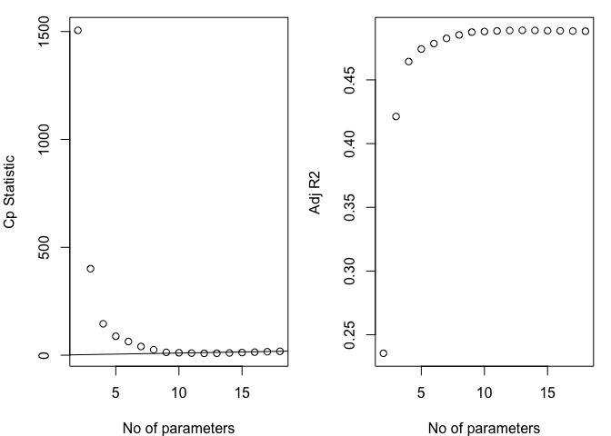

Exploratory
================
12/4/2018

Data manipulation
-----------------

``` r
cancer_df =
  read_csv("Cancer_Registry.csv") %>% 
  janitor::clean_names()

raw_data =
  cancer_df %>%


  dplyr::select(-pct_employed16_over, - pct_private_coverage_alone, -binned_inc) %>% 
  dplyr::select(-geography, -avg_deaths_per_year, -pop_est2015, -pct_no_hs18_24 , -pct_hs18_24 , -pct_bach_deg18_24, -pct_some_col18_24, -median_age, -pct_private_coverage, -pct_public_coverage, -pct_public_coverage_alone, -percent_married , -birth_rate) %>% 
  dplyr::select(target_death_rate, everything()) 
```

-   First we remove two variables with lots of missing values "pct\_employed16\_over" and "pct\_private\_coverage\_alone".
-   Then we remove "binned\_inc" and "birth\_rate" because ?????
-   "avg\_deaths\_per\_year", "avg\_ann\_count" and "pop\_est2015" are highly correlated. The last three steps show that we should choose avg\_ann\_count, because the p-value is the smallest, showing significant relation between target\_death\_rate and avg\_ann\_count.
-   Finally we plan to choose at least one variable from each category. We fit each variables in MLR and find the variable with small p-value. Finally we get 17 variables left and get raw\_data.

### stepwise

``` r
model1 <- lm(target_death_rate ~ ., data = raw_data)
step(model1, direction = 'backward') %>%
  summary()
```

    ## Start:  AIC=18229.32
    ## target_death_rate ~ avg_ann_count + incidence_rate + med_income + 
    ##     poverty_percent + study_per_cap + median_age_male + median_age_female + 
    ##     avg_household_size + pct_hs25_over + pct_bach_deg25_over + 
    ##     pct_unemployed16_over + pct_emp_priv_coverage + pct_white + 
    ##     pct_black + pct_asian + pct_other_race + pct_married_households
    ## 
    ##                          Df Sum of Sq     RSS   AIC
    ## - median_age_male         1        29 1194018 18227
    ## - pct_emp_priv_coverage   1        34 1194023 18227
    ## - pct_asian               1        56 1194045 18228
    ## - study_per_cap           1        66 1194055 18228
    ## - avg_household_size      1       212 1194201 18228
    ## - median_age_female       1       245 1194234 18228
    ## - med_income              1       490 1194479 18229
    ## - pct_black               1       738 1194727 18229
    ## <none>                                1193989 18229
    ## - pct_white               1      1065 1195054 18230
    ## - avg_ann_count           1      1964 1195953 18232
    ## - pct_married_households  1      5888 1199877 18242
    ## - pct_unemployed16_over   1      7824 1201813 18247
    ## - poverty_percent         1     10294 1204283 18254
    ## - pct_hs25_over           1     11177 1205166 18256
    ## - pct_other_race          1     15362 1209351 18266
    ## - pct_bach_deg25_over     1     36450 1230439 18319
    ## - incidence_rate          1    298094 1492083 18906
    ## 
    ## Step:  AIC=18227.4
    ## target_death_rate ~ avg_ann_count + incidence_rate + med_income + 
    ##     poverty_percent + study_per_cap + median_age_female + avg_household_size + 
    ##     pct_hs25_over + pct_bach_deg25_over + pct_unemployed16_over + 
    ##     pct_emp_priv_coverage + pct_white + pct_black + pct_asian + 
    ##     pct_other_race + pct_married_households
    ## 
    ##                          Df Sum of Sq     RSS   AIC
    ## - pct_emp_priv_coverage   1        27 1194045 18226
    ## - pct_asian               1        55 1194073 18226
    ## - study_per_cap           1        64 1194082 18226
    ## - avg_household_size      1       215 1194233 18226
    ## - med_income              1       485 1194503 18227
    ## - pct_black               1       719 1194737 18227
    ## <none>                                1194018 18227
    ## - pct_white               1      1077 1195095 18228
    ## - median_age_female       1      1818 1195836 18230
    ## - avg_ann_count           1      1951 1195969 18230
    ## - pct_married_households  1      5905 1199923 18240
    ## - pct_unemployed16_over   1      7800 1201818 18245
    ## - poverty_percent         1     10501 1204519 18252
    ## - pct_hs25_over           1     11156 1205174 18254
    ## - pct_other_race          1     15340 1209358 18264
    ## - pct_bach_deg25_over     1     36857 1230875 18318
    ## - incidence_rate          1    298079 1492097 18904
    ## 
    ## Step:  AIC=18225.47
    ## target_death_rate ~ avg_ann_count + incidence_rate + med_income + 
    ##     poverty_percent + study_per_cap + median_age_female + avg_household_size + 
    ##     pct_hs25_over + pct_bach_deg25_over + pct_unemployed16_over + 
    ##     pct_white + pct_black + pct_asian + pct_other_race + pct_married_households
    ## 
    ##                          Df Sum of Sq     RSS   AIC
    ## - pct_asian               1        47 1194092 18224
    ## - study_per_cap           1        70 1194115 18224
    ## - avg_household_size      1       224 1194269 18224
    ## - med_income              1       472 1194517 18225
    ## <none>                                1194045 18226
    ## - pct_black               1       867 1194912 18226
    ## - pct_white               1      1331 1195377 18227
    ## - avg_ann_count           1      1969 1196014 18229
    ## - median_age_female       1      2109 1196154 18229
    ## - pct_married_households  1      5912 1199958 18239
    ## - pct_unemployed16_over   1      7970 1202016 18244
    ## - poverty_percent         1     11159 1205205 18252
    ## - pct_hs25_over           1     11763 1205808 18253
    ## - pct_other_race          1     15319 1209364 18262
    ## - pct_bach_deg25_over     1     37730 1231775 18318
    ## - incidence_rate          1    302501 1496546 18912
    ## 
    ## Step:  AIC=18223.59
    ## target_death_rate ~ avg_ann_count + incidence_rate + med_income + 
    ##     poverty_percent + study_per_cap + median_age_female + avg_household_size + 
    ##     pct_hs25_over + pct_bach_deg25_over + pct_unemployed16_over + 
    ##     pct_white + pct_black + pct_other_race + pct_married_households
    ## 
    ##                          Df Sum of Sq     RSS   AIC
    ## - study_per_cap           1        67 1194159 18222
    ## - avg_household_size      1       218 1194310 18222
    ## - med_income              1       580 1194673 18223
    ## <none>                                1194092 18224
    ## - pct_black               1      1092 1195184 18224
    ## - pct_white               1      1662 1195754 18226
    ## - avg_ann_count           1      1956 1196049 18227
    ## - median_age_female       1      2105 1196198 18227
    ## - pct_married_households  1      6010 1200102 18237
    ## - pct_unemployed16_over   1      7965 1202057 18242
    ## - poverty_percent         1     11416 1205508 18251
    ## - pct_hs25_over           1     11723 1205815 18251
    ## - pct_other_race          1     15465 1209557 18261
    ## - pct_bach_deg25_over     1     37693 1231785 18316
    ## - incidence_rate          1    302512 1496604 18910
    ## 
    ## Step:  AIC=18221.76
    ## target_death_rate ~ avg_ann_count + incidence_rate + med_income + 
    ##     poverty_percent + median_age_female + avg_household_size + 
    ##     pct_hs25_over + pct_bach_deg25_over + pct_unemployed16_over + 
    ##     pct_white + pct_black + pct_other_race + pct_married_households
    ## 
    ##                          Df Sum of Sq     RSS   AIC
    ## - avg_household_size      1       212 1194371 18220
    ## - med_income              1       603 1194762 18221
    ## <none>                                1194159 18222
    ## - pct_black               1      1095 1195255 18223
    ## - pct_white               1      1685 1195844 18224
    ## - avg_ann_count           1      1991 1196150 18225
    ## - median_age_female       1      2088 1196247 18225
    ## - pct_married_households  1      5953 1200113 18235
    ## - pct_unemployed16_over   1      7960 1202120 18240
    ## - poverty_percent         1     11548 1205707 18249
    ## - pct_hs25_over           1     11778 1205937 18250
    ## - pct_other_race          1     15447 1209606 18259
    ## - pct_bach_deg25_over     1     37872 1232031 18315
    ## - incidence_rate          1    303189 1497348 18909
    ## 
    ## Step:  AIC=18220.3
    ## target_death_rate ~ avg_ann_count + incidence_rate + med_income + 
    ##     poverty_percent + median_age_female + pct_hs25_over + pct_bach_deg25_over + 
    ##     pct_unemployed16_over + pct_white + pct_black + pct_other_race + 
    ##     pct_married_households
    ## 
    ##                          Df Sum of Sq     RSS   AIC
    ## - med_income              1       675 1195046 18220
    ## <none>                                1194371 18220
    ## - pct_black               1      1206 1195577 18221
    ## - pct_white               1      1877 1196248 18223
    ## - avg_ann_count           1      1959 1196329 18223
    ## - median_age_female       1      2625 1196995 18225
    ## - pct_married_households  1      5743 1200114 18233
    ## - pct_unemployed16_over   1      8298 1202669 18239
    ## - pct_hs25_over           1     11784 1206155 18248
    ## - poverty_percent         1     11924 1206294 18249
    ## - pct_other_race          1     15311 1209681 18257
    ## - pct_bach_deg25_over     1     38154 1232525 18314
    ## - incidence_rate          1    303682 1498053 18909
    ## 
    ## Step:  AIC=18220.02
    ## target_death_rate ~ avg_ann_count + incidence_rate + poverty_percent + 
    ##     median_age_female + pct_hs25_over + pct_bach_deg25_over + 
    ##     pct_unemployed16_over + pct_white + pct_black + pct_other_race + 
    ##     pct_married_households
    ## 
    ##                          Df Sum of Sq     RSS   AIC
    ## <none>                                1195046 18220
    ## - pct_black               1      1247 1196293 18221
    ## - avg_ann_count           1      1777 1196823 18223
    ## - pct_white               1      2579 1197625 18225
    ## - median_age_female       1      3518 1198564 18227
    ## - pct_married_households  1      5074 1200119 18231
    ## - pct_unemployed16_over   1      8944 1203989 18241
    ## - pct_hs25_over           1     11504 1206550 18247
    ## - poverty_percent         1     14541 1209587 18255
    ## - pct_other_race          1     15247 1210293 18257
    ## - pct_bach_deg25_over     1     39071 1234117 18316
    ## - incidence_rate          1    308930 1503976 18919

    ## 
    ## Call:
    ## lm(formula = target_death_rate ~ avg_ann_count + incidence_rate + 
    ##     poverty_percent + median_age_female + pct_hs25_over + pct_bach_deg25_over + 
    ##     pct_unemployed16_over + pct_white + pct_black + pct_other_race + 
    ##     pct_married_households, data = raw_data)
    ## 
    ## Residuals:
    ##      Min       1Q   Median       3Q      Max 
    ## -113.855  -11.308   -0.144   11.205  140.652 
    ## 
    ## Coefficients:
    ##                          Estimate Std. Error t value Pr(>|t|)    
    ## (Intercept)             1.128e+02  9.782e+00  11.527  < 2e-16 ***
    ## avg_ann_count          -5.983e-04  2.816e-04  -2.124 0.033711 *  
    ## incidence_rate          1.980e-01  7.070e-03  28.010  < 2e-16 ***
    ## poverty_percent         6.236e-01  1.026e-01   6.077 1.38e-09 ***
    ## median_age_female      -2.350e-01  7.862e-02  -2.989 0.002821 ** 
    ## pct_hs25_over           4.897e-01  9.060e-02   5.405 6.97e-08 ***
    ## pct_bach_deg25_over    -1.340e+00  1.345e-01  -9.961  < 2e-16 ***
    ## pct_unemployed16_over   7.023e-01  1.474e-01   4.766 1.97e-06 ***
    ## pct_white              -1.267e-01  4.952e-02  -2.559 0.010539 *  
    ## pct_black              -8.936e-02  5.021e-02  -1.780 0.075247 .  
    ## pct_other_race         -7.779e-01  1.250e-01  -6.223 5.55e-10 ***
    ## pct_married_households -2.913e-01  8.116e-02  -3.590 0.000336 ***
    ## ---
    ## Signif. codes:  0 '***' 0.001 '**' 0.01 '*' 0.05 '.' 0.1 ' ' 1
    ## 
    ## Residual standard error: 19.84 on 3035 degrees of freedom
    ## Multiple R-squared:  0.4906, Adjusted R-squared:  0.4887 
    ## F-statistic: 265.7 on 11 and 3035 DF,  p-value: < 2.2e-16

### cp and adjusted R

``` r
b<-regsubsets(target_death_rate ~ ., data=raw_data, nvmax = 30)
   (rs<-summary(b))
```

    ## Subset selection object
    ## Call: regsubsets.formula(target_death_rate ~ ., data = raw_data, nvmax = 30)
    ## 17 Variables  (and intercept)
    ##                        Forced in Forced out
    ## avg_ann_count              FALSE      FALSE
    ## incidence_rate             FALSE      FALSE
    ## med_income                 FALSE      FALSE
    ## poverty_percent            FALSE      FALSE
    ## study_per_cap              FALSE      FALSE
    ## median_age_male            FALSE      FALSE
    ## median_age_female          FALSE      FALSE
    ## avg_household_size         FALSE      FALSE
    ## pct_hs25_over              FALSE      FALSE
    ## pct_bach_deg25_over        FALSE      FALSE
    ## pct_unemployed16_over      FALSE      FALSE
    ## pct_emp_priv_coverage      FALSE      FALSE
    ## pct_white                  FALSE      FALSE
    ## pct_black                  FALSE      FALSE
    ## pct_asian                  FALSE      FALSE
    ## pct_other_race             FALSE      FALSE
    ## pct_married_households     FALSE      FALSE
    ## 1 subsets of each size up to 17
    ## Selection Algorithm: exhaustive
    ##           avg_ann_count incidence_rate med_income poverty_percent
    ## 1  ( 1 )  " "           " "            " "        " "            
    ## 2  ( 1 )  " "           "*"            " "        " "            
    ## 3  ( 1 )  " "           "*"            " "        "*"            
    ## 4  ( 1 )  " "           "*"            " "        "*"            
    ## 5  ( 1 )  " "           "*"            " "        "*"            
    ## 6  ( 1 )  " "           "*"            " "        "*"            
    ## 7  ( 1 )  " "           "*"            " "        "*"            
    ## 8  ( 1 )  " "           "*"            " "        "*"            
    ## 9  ( 1 )  "*"           "*"            " "        "*"            
    ## 10  ( 1 ) "*"           "*"            "*"        "*"            
    ## 11  ( 1 ) "*"           "*"            " "        "*"            
    ## 12  ( 1 ) "*"           "*"            "*"        "*"            
    ## 13  ( 1 ) "*"           "*"            "*"        "*"            
    ## 14  ( 1 ) "*"           "*"            "*"        "*"            
    ## 15  ( 1 ) "*"           "*"            "*"        "*"            
    ## 16  ( 1 ) "*"           "*"            "*"        "*"            
    ## 17  ( 1 ) "*"           "*"            "*"        "*"            
    ##           study_per_cap median_age_male median_age_female
    ## 1  ( 1 )  " "           " "             " "              
    ## 2  ( 1 )  " "           " "             " "              
    ## 3  ( 1 )  " "           " "             " "              
    ## 4  ( 1 )  " "           " "             " "              
    ## 5  ( 1 )  " "           " "             " "              
    ## 6  ( 1 )  " "           " "             " "              
    ## 7  ( 1 )  " "           " "             " "              
    ## 8  ( 1 )  " "           " "             "*"              
    ## 9  ( 1 )  " "           " "             "*"              
    ## 10  ( 1 ) " "           " "             "*"              
    ## 11  ( 1 ) " "           " "             "*"              
    ## 12  ( 1 ) " "           " "             "*"              
    ## 13  ( 1 ) " "           " "             "*"              
    ## 14  ( 1 ) "*"           " "             "*"              
    ## 15  ( 1 ) "*"           " "             "*"              
    ## 16  ( 1 ) "*"           " "             "*"              
    ## 17  ( 1 ) "*"           "*"             "*"              
    ##           avg_household_size pct_hs25_over pct_bach_deg25_over
    ## 1  ( 1 )  " "                " "           "*"                
    ## 2  ( 1 )  " "                " "           "*"                
    ## 3  ( 1 )  " "                " "           "*"                
    ## 4  ( 1 )  " "                " "           "*"                
    ## 5  ( 1 )  " "                " "           "*"                
    ## 6  ( 1 )  " "                "*"           "*"                
    ## 7  ( 1 )  " "                "*"           "*"                
    ## 8  ( 1 )  " "                "*"           "*"                
    ## 9  ( 1 )  " "                "*"           "*"                
    ## 10  ( 1 ) " "                "*"           "*"                
    ## 11  ( 1 ) " "                "*"           "*"                
    ## 12  ( 1 ) " "                "*"           "*"                
    ## 13  ( 1 ) "*"                "*"           "*"                
    ## 14  ( 1 ) "*"                "*"           "*"                
    ## 15  ( 1 ) "*"                "*"           "*"                
    ## 16  ( 1 ) "*"                "*"           "*"                
    ## 17  ( 1 ) "*"                "*"           "*"                
    ##           pct_unemployed16_over pct_emp_priv_coverage pct_white pct_black
    ## 1  ( 1 )  " "                   " "                   " "       " "      
    ## 2  ( 1 )  " "                   " "                   " "       " "      
    ## 3  ( 1 )  " "                   " "                   " "       " "      
    ## 4  ( 1 )  " "                   " "                   " "       " "      
    ## 5  ( 1 )  "*"                   " "                   " "       " "      
    ## 6  ( 1 )  "*"                   " "                   " "       " "      
    ## 7  ( 1 )  "*"                   " "                   " "       " "      
    ## 8  ( 1 )  "*"                   " "                   " "       " "      
    ## 9  ( 1 )  "*"                   " "                   " "       " "      
    ## 10  ( 1 ) "*"                   " "                   " "       " "      
    ## 11  ( 1 ) "*"                   " "                   "*"       "*"      
    ## 12  ( 1 ) "*"                   " "                   "*"       "*"      
    ## 13  ( 1 ) "*"                   " "                   "*"       "*"      
    ## 14  ( 1 ) "*"                   " "                   "*"       "*"      
    ## 15  ( 1 ) "*"                   " "                   "*"       "*"      
    ## 16  ( 1 ) "*"                   "*"                   "*"       "*"      
    ## 17  ( 1 ) "*"                   "*"                   "*"       "*"      
    ##           pct_asian pct_other_race pct_married_households
    ## 1  ( 1 )  " "       " "            " "                   
    ## 2  ( 1 )  " "       " "            " "                   
    ## 3  ( 1 )  " "       " "            " "                   
    ## 4  ( 1 )  " "       "*"            " "                   
    ## 5  ( 1 )  " "       "*"            " "                   
    ## 6  ( 1 )  " "       "*"            " "                   
    ## 7  ( 1 )  " "       "*"            "*"                   
    ## 8  ( 1 )  " "       "*"            "*"                   
    ## 9  ( 1 )  " "       "*"            "*"                   
    ## 10  ( 1 ) " "       "*"            "*"                   
    ## 11  ( 1 ) " "       "*"            "*"                   
    ## 12  ( 1 ) " "       "*"            "*"                   
    ## 13  ( 1 ) " "       "*"            "*"                   
    ## 14  ( 1 ) " "       "*"            "*"                   
    ## 15  ( 1 ) "*"       "*"            "*"                   
    ## 16  ( 1 ) "*"       "*"            "*"                   
    ## 17  ( 1 ) "*"       "*"            "*"

``` r
par(mar=c(4,4,1,1))
par(mfrow=c(1,2))

plot(2:18, rs$cp, xlab="No of parameters", ylab="Cp Statistic")
abline(0,1)

plot(2:18, rs$adjr2, xlab="No of parameters", ylab="Adj R2")
```

 From the plot of Cp, points from four to ten all lie on the line, indicating subsets with these number of variables all doing good job. Also, from plot of R square, subsets with number of 9 to 17 variables are are doing well as well. Thus, for parcimony, we decide to choose the subsets with four variables, which are incidence\_rate, poverty\_percent, avg\_ann\_count, pct\_hs25\_over, pct\_bach\_deg25\_over, pct\_unemployed16\_over, pct\_married\_households, median\_age\_female, and pct\_white.
