Exploratory
================
12/4/2018

Data manipulation
-----------------

``` r
cancer_df =
  read_csv("Cancer_Registry.csv") %>% 
  janitor::clean_names()

raw_data =
  cancer_df %>%
  dplyr::select(-pct_employed16_over, -pct_private_coverage_alone, -binned_inc) %>% 
  dplyr::select(-geography, -avg_deaths_per_year, -pop_est2015, -pct_no_hs18_24 , -pct_hs18_24 , -pct_bach_deg18_24, -pct_some_col18_24, -median_age, -pct_private_coverage, -pct_public_coverage, -pct_public_coverage_alone, -percent_married , -birth_rate) %>% 
  dplyr::select(target_death_rate, everything()) 
```

-   First we remove two variables with lots of missing values "pct\_employed16\_over" and "pct\_private\_coverage\_alone".
-   Then we remove "binned\_inc" and "birth\_rate" because we think they are not correlated to target death rate.
-   "avg\_deaths\_per\_year", "avg\_ann\_count" and "pop\_est2015" are highly correlated. The last three steps show that we should choose avg\_ann\_count, because the p-value is the smallest, showing significant relation between target\_death\_rate and avg\_ann\_count.
-   Finally we plan to choose at least one variable from each category. We fit each variables in MLR and find the variable with small p-value. Finally we get 17 variables left and get raw\_data.

### stepwise

``` r
model1 <- lm(target_death_rate ~ ., data = raw_data)
step(model1, direction = 'backward') %>%
  summary() 
```

    ## Start:  AIC=18229.32
    ## target_death_rate ~ avg_ann_count + incidence_rate + med_income + 
    ##     poverty_percent + study_per_cap + median_age_male + median_age_female + 
    ##     avg_household_size + pct_hs25_over + pct_bach_deg25_over + 
    ##     pct_unemployed16_over + pct_emp_priv_coverage + pct_white + 
    ##     pct_black + pct_asian + pct_other_race + pct_married_households
    ## 
    ##                          Df Sum of Sq     RSS   AIC
    ## - median_age_male         1        29 1194018 18227
    ## - pct_emp_priv_coverage   1        34 1194023 18227
    ## - pct_asian               1        56 1194045 18228
    ## - study_per_cap           1        66 1194055 18228
    ## - avg_household_size      1       212 1194201 18228
    ## - median_age_female       1       245 1194234 18228
    ## - med_income              1       490 1194479 18229
    ## - pct_black               1       738 1194727 18229
    ## <none>                                1193989 18229
    ## - pct_white               1      1065 1195054 18230
    ## - avg_ann_count           1      1964 1195953 18232
    ## - pct_married_households  1      5888 1199877 18242
    ## - pct_unemployed16_over   1      7824 1201813 18247
    ## - poverty_percent         1     10294 1204283 18254
    ## - pct_hs25_over           1     11177 1205166 18256
    ## - pct_other_race          1     15362 1209351 18266
    ## - pct_bach_deg25_over     1     36450 1230439 18319
    ## - incidence_rate          1    298094 1492083 18906
    ## 
    ## Step:  AIC=18227.4
    ## target_death_rate ~ avg_ann_count + incidence_rate + med_income + 
    ##     poverty_percent + study_per_cap + median_age_female + avg_household_size + 
    ##     pct_hs25_over + pct_bach_deg25_over + pct_unemployed16_over + 
    ##     pct_emp_priv_coverage + pct_white + pct_black + pct_asian + 
    ##     pct_other_race + pct_married_households
    ## 
    ##                          Df Sum of Sq     RSS   AIC
    ## - pct_emp_priv_coverage   1        27 1194045 18226
    ## - pct_asian               1        55 1194073 18226
    ## - study_per_cap           1        64 1194082 18226
    ## - avg_household_size      1       215 1194233 18226
    ## - med_income              1       485 1194503 18227
    ## - pct_black               1       719 1194737 18227
    ## <none>                                1194018 18227
    ## - pct_white               1      1077 1195095 18228
    ## - median_age_female       1      1818 1195836 18230
    ## - avg_ann_count           1      1951 1195969 18230
    ## - pct_married_households  1      5905 1199923 18240
    ## - pct_unemployed16_over   1      7800 1201818 18245
    ## - poverty_percent         1     10501 1204519 18252
    ## - pct_hs25_over           1     11156 1205174 18254
    ## - pct_other_race          1     15340 1209358 18264
    ## - pct_bach_deg25_over     1     36857 1230875 18318
    ## - incidence_rate          1    298079 1492097 18904
    ## 
    ## Step:  AIC=18225.47
    ## target_death_rate ~ avg_ann_count + incidence_rate + med_income + 
    ##     poverty_percent + study_per_cap + median_age_female + avg_household_size + 
    ##     pct_hs25_over + pct_bach_deg25_over + pct_unemployed16_over + 
    ##     pct_white + pct_black + pct_asian + pct_other_race + pct_married_households
    ## 
    ##                          Df Sum of Sq     RSS   AIC
    ## - pct_asian               1        47 1194092 18224
    ## - study_per_cap           1        70 1194115 18224
    ## - avg_household_size      1       224 1194269 18224
    ## - med_income              1       472 1194517 18225
    ## <none>                                1194045 18226
    ## - pct_black               1       867 1194912 18226
    ## - pct_white               1      1331 1195377 18227
    ## - avg_ann_count           1      1969 1196014 18229
    ## - median_age_female       1      2109 1196154 18229
    ## - pct_married_households  1      5912 1199958 18239
    ## - pct_unemployed16_over   1      7970 1202016 18244
    ## - poverty_percent         1     11159 1205205 18252
    ## - pct_hs25_over           1     11763 1205808 18253
    ## - pct_other_race          1     15319 1209364 18262
    ## - pct_bach_deg25_over     1     37730 1231775 18318
    ## - incidence_rate          1    302501 1496546 18912
    ## 
    ## Step:  AIC=18223.59
    ## target_death_rate ~ avg_ann_count + incidence_rate + med_income + 
    ##     poverty_percent + study_per_cap + median_age_female + avg_household_size + 
    ##     pct_hs25_over + pct_bach_deg25_over + pct_unemployed16_over + 
    ##     pct_white + pct_black + pct_other_race + pct_married_households
    ## 
    ##                          Df Sum of Sq     RSS   AIC
    ## - study_per_cap           1        67 1194159 18222
    ## - avg_household_size      1       218 1194310 18222
    ## - med_income              1       580 1194673 18223
    ## <none>                                1194092 18224
    ## - pct_black               1      1092 1195184 18224
    ## - pct_white               1      1662 1195754 18226
    ## - avg_ann_count           1      1956 1196049 18227
    ## - median_age_female       1      2105 1196198 18227
    ## - pct_married_households  1      6010 1200102 18237
    ## - pct_unemployed16_over   1      7965 1202057 18242
    ## - poverty_percent         1     11416 1205508 18251
    ## - pct_hs25_over           1     11723 1205815 18251
    ## - pct_other_race          1     15465 1209557 18261
    ## - pct_bach_deg25_over     1     37693 1231785 18316
    ## - incidence_rate          1    302512 1496604 18910
    ## 
    ## Step:  AIC=18221.76
    ## target_death_rate ~ avg_ann_count + incidence_rate + med_income + 
    ##     poverty_percent + median_age_female + avg_household_size + 
    ##     pct_hs25_over + pct_bach_deg25_over + pct_unemployed16_over + 
    ##     pct_white + pct_black + pct_other_race + pct_married_households
    ## 
    ##                          Df Sum of Sq     RSS   AIC
    ## - avg_household_size      1       212 1194371 18220
    ## - med_income              1       603 1194762 18221
    ## <none>                                1194159 18222
    ## - pct_black               1      1095 1195255 18223
    ## - pct_white               1      1685 1195844 18224
    ## - avg_ann_count           1      1991 1196150 18225
    ## - median_age_female       1      2088 1196247 18225
    ## - pct_married_households  1      5953 1200113 18235
    ## - pct_unemployed16_over   1      7960 1202120 18240
    ## - poverty_percent         1     11548 1205707 18249
    ## - pct_hs25_over           1     11778 1205937 18250
    ## - pct_other_race          1     15447 1209606 18259
    ## - pct_bach_deg25_over     1     37872 1232031 18315
    ## - incidence_rate          1    303189 1497348 18909
    ## 
    ## Step:  AIC=18220.3
    ## target_death_rate ~ avg_ann_count + incidence_rate + med_income + 
    ##     poverty_percent + median_age_female + pct_hs25_over + pct_bach_deg25_over + 
    ##     pct_unemployed16_over + pct_white + pct_black + pct_other_race + 
    ##     pct_married_households
    ## 
    ##                          Df Sum of Sq     RSS   AIC
    ## - med_income              1       675 1195046 18220
    ## <none>                                1194371 18220
    ## - pct_black               1      1206 1195577 18221
    ## - pct_white               1      1877 1196248 18223
    ## - avg_ann_count           1      1959 1196329 18223
    ## - median_age_female       1      2625 1196995 18225
    ## - pct_married_households  1      5743 1200114 18233
    ## - pct_unemployed16_over   1      8298 1202669 18239
    ## - pct_hs25_over           1     11784 1206155 18248
    ## - poverty_percent         1     11924 1206294 18249
    ## - pct_other_race          1     15311 1209681 18257
    ## - pct_bach_deg25_over     1     38154 1232525 18314
    ## - incidence_rate          1    303682 1498053 18909
    ## 
    ## Step:  AIC=18220.02
    ## target_death_rate ~ avg_ann_count + incidence_rate + poverty_percent + 
    ##     median_age_female + pct_hs25_over + pct_bach_deg25_over + 
    ##     pct_unemployed16_over + pct_white + pct_black + pct_other_race + 
    ##     pct_married_households
    ## 
    ##                          Df Sum of Sq     RSS   AIC
    ## <none>                                1195046 18220
    ## - pct_black               1      1247 1196293 18221
    ## - avg_ann_count           1      1777 1196823 18223
    ## - pct_white               1      2579 1197625 18225
    ## - median_age_female       1      3518 1198564 18227
    ## - pct_married_households  1      5074 1200119 18231
    ## - pct_unemployed16_over   1      8944 1203989 18241
    ## - pct_hs25_over           1     11504 1206550 18247
    ## - poverty_percent         1     14541 1209587 18255
    ## - pct_other_race          1     15247 1210293 18257
    ## - pct_bach_deg25_over     1     39071 1234117 18316
    ## - incidence_rate          1    308930 1503976 18919

    ## 
    ## Call:
    ## lm(formula = target_death_rate ~ avg_ann_count + incidence_rate + 
    ##     poverty_percent + median_age_female + pct_hs25_over + pct_bach_deg25_over + 
    ##     pct_unemployed16_over + pct_white + pct_black + pct_other_race + 
    ##     pct_married_households, data = raw_data)
    ## 
    ## Residuals:
    ##      Min       1Q   Median       3Q      Max 
    ## -113.855  -11.308   -0.144   11.205  140.652 
    ## 
    ## Coefficients:
    ##                          Estimate Std. Error t value Pr(>|t|)    
    ## (Intercept)             1.128e+02  9.782e+00  11.527  < 2e-16 ***
    ## avg_ann_count          -5.983e-04  2.816e-04  -2.124 0.033711 *  
    ## incidence_rate          1.980e-01  7.070e-03  28.010  < 2e-16 ***
    ## poverty_percent         6.236e-01  1.026e-01   6.077 1.38e-09 ***
    ## median_age_female      -2.350e-01  7.862e-02  -2.989 0.002821 ** 
    ## pct_hs25_over           4.897e-01  9.060e-02   5.405 6.97e-08 ***
    ## pct_bach_deg25_over    -1.340e+00  1.345e-01  -9.961  < 2e-16 ***
    ## pct_unemployed16_over   7.023e-01  1.474e-01   4.766 1.97e-06 ***
    ## pct_white              -1.267e-01  4.952e-02  -2.559 0.010539 *  
    ## pct_black              -8.936e-02  5.021e-02  -1.780 0.075247 .  
    ## pct_other_race         -7.779e-01  1.250e-01  -6.223 5.55e-10 ***
    ## pct_married_households -2.913e-01  8.116e-02  -3.590 0.000336 ***
    ## ---
    ## Signif. codes:  0 '***' 0.001 '**' 0.01 '*' 0.05 '.' 0.1 ' ' 1
    ## 
    ## Residual standard error: 19.84 on 3035 degrees of freedom
    ## Multiple R-squared:  0.4906, Adjusted R-squared:  0.4887 
    ## F-statistic: 265.7 on 11 and 3035 DF,  p-value: < 2.2e-16

``` r
model2 <- lm(target_death_rate ~ ., data = raw_data)
step(model1, direction = 'both') %>%
  summary() 
```

    ## Start:  AIC=18229.32
    ## target_death_rate ~ avg_ann_count + incidence_rate + med_income + 
    ##     poverty_percent + study_per_cap + median_age_male + median_age_female + 
    ##     avg_household_size + pct_hs25_over + pct_bach_deg25_over + 
    ##     pct_unemployed16_over + pct_emp_priv_coverage + pct_white + 
    ##     pct_black + pct_asian + pct_other_race + pct_married_households
    ## 
    ##                          Df Sum of Sq     RSS   AIC
    ## - median_age_male         1        29 1194018 18227
    ## - pct_emp_priv_coverage   1        34 1194023 18227
    ## - pct_asian               1        56 1194045 18228
    ## - study_per_cap           1        66 1194055 18228
    ## - avg_household_size      1       212 1194201 18228
    ## - median_age_female       1       245 1194234 18228
    ## - med_income              1       490 1194479 18229
    ## - pct_black               1       738 1194727 18229
    ## <none>                                1193989 18229
    ## - pct_white               1      1065 1195054 18230
    ## - avg_ann_count           1      1964 1195953 18232
    ## - pct_married_households  1      5888 1199877 18242
    ## - pct_unemployed16_over   1      7824 1201813 18247
    ## - poverty_percent         1     10294 1204283 18254
    ## - pct_hs25_over           1     11177 1205166 18256
    ## - pct_other_race          1     15362 1209351 18266
    ## - pct_bach_deg25_over     1     36450 1230439 18319
    ## - incidence_rate          1    298094 1492083 18906
    ## 
    ## Step:  AIC=18227.4
    ## target_death_rate ~ avg_ann_count + incidence_rate + med_income + 
    ##     poverty_percent + study_per_cap + median_age_female + avg_household_size + 
    ##     pct_hs25_over + pct_bach_deg25_over + pct_unemployed16_over + 
    ##     pct_emp_priv_coverage + pct_white + pct_black + pct_asian + 
    ##     pct_other_race + pct_married_households
    ## 
    ##                          Df Sum of Sq     RSS   AIC
    ## - pct_emp_priv_coverage   1        27 1194045 18226
    ## - pct_asian               1        55 1194073 18226
    ## - study_per_cap           1        64 1194082 18226
    ## - avg_household_size      1       215 1194233 18226
    ## - med_income              1       485 1194503 18227
    ## - pct_black               1       719 1194737 18227
    ## <none>                                1194018 18227
    ## - pct_white               1      1077 1195095 18228
    ## + median_age_male         1        29 1193989 18229
    ## - median_age_female       1      1818 1195836 18230
    ## - avg_ann_count           1      1951 1195969 18230
    ## - pct_married_households  1      5905 1199923 18240
    ## - pct_unemployed16_over   1      7800 1201818 18245
    ## - poverty_percent         1     10501 1204519 18252
    ## - pct_hs25_over           1     11156 1205174 18254
    ## - pct_other_race          1     15340 1209358 18264
    ## - pct_bach_deg25_over     1     36857 1230875 18318
    ## - incidence_rate          1    298079 1492097 18904
    ## 
    ## Step:  AIC=18225.47
    ## target_death_rate ~ avg_ann_count + incidence_rate + med_income + 
    ##     poverty_percent + study_per_cap + median_age_female + avg_household_size + 
    ##     pct_hs25_over + pct_bach_deg25_over + pct_unemployed16_over + 
    ##     pct_white + pct_black + pct_asian + pct_other_race + pct_married_households
    ## 
    ##                          Df Sum of Sq     RSS   AIC
    ## - pct_asian               1        47 1194092 18224
    ## - study_per_cap           1        70 1194115 18224
    ## - avg_household_size      1       224 1194269 18224
    ## - med_income              1       472 1194517 18225
    ## <none>                                1194045 18226
    ## - pct_black               1       867 1194912 18226
    ## - pct_white               1      1331 1195377 18227
    ## + pct_emp_priv_coverage   1        27 1194018 18227
    ## + median_age_male         1        22 1194023 18227
    ## - avg_ann_count           1      1969 1196014 18229
    ## - median_age_female       1      2109 1196154 18229
    ## - pct_married_households  1      5912 1199958 18239
    ## - pct_unemployed16_over   1      7970 1202016 18244
    ## - poverty_percent         1     11159 1205205 18252
    ## - pct_hs25_over           1     11763 1205808 18253
    ## - pct_other_race          1     15319 1209364 18262
    ## - pct_bach_deg25_over     1     37730 1231775 18318
    ## - incidence_rate          1    302501 1496546 18912
    ## 
    ## Step:  AIC=18223.59
    ## target_death_rate ~ avg_ann_count + incidence_rate + med_income + 
    ##     poverty_percent + study_per_cap + median_age_female + avg_household_size + 
    ##     pct_hs25_over + pct_bach_deg25_over + pct_unemployed16_over + 
    ##     pct_white + pct_black + pct_other_race + pct_married_households
    ## 
    ##                          Df Sum of Sq     RSS   AIC
    ## - study_per_cap           1        67 1194159 18222
    ## - avg_household_size      1       218 1194310 18222
    ## - med_income              1       580 1194673 18223
    ## <none>                                1194092 18224
    ## - pct_black               1      1092 1195184 18224
    ## + pct_asian               1        47 1194045 18226
    ## + median_age_male         1        22 1194070 18226
    ## + pct_emp_priv_coverage   1        20 1194073 18226
    ## - pct_white               1      1662 1195754 18226
    ## - avg_ann_count           1      1956 1196049 18227
    ## - median_age_female       1      2105 1196198 18227
    ## - pct_married_households  1      6010 1200102 18237
    ## - pct_unemployed16_over   1      7965 1202057 18242
    ## - poverty_percent         1     11416 1205508 18251
    ## - pct_hs25_over           1     11723 1205815 18251
    ## - pct_other_race          1     15465 1209557 18261
    ## - pct_bach_deg25_over     1     37693 1231785 18316
    ## - incidence_rate          1    302512 1496604 18910
    ## 
    ## Step:  AIC=18221.76
    ## target_death_rate ~ avg_ann_count + incidence_rate + med_income + 
    ##     poverty_percent + median_age_female + avg_household_size + 
    ##     pct_hs25_over + pct_bach_deg25_over + pct_unemployed16_over + 
    ##     pct_white + pct_black + pct_other_race + pct_married_households
    ## 
    ##                          Df Sum of Sq     RSS   AIC
    ## - avg_household_size      1       212 1194371 18220
    ## - med_income              1       603 1194762 18221
    ## <none>                                1194159 18222
    ## - pct_black               1      1095 1195255 18223
    ## + study_per_cap           1        67 1194092 18224
    ## + pct_asian               1        44 1194115 18224
    ## + pct_emp_priv_coverage   1        25 1194134 18224
    ## + median_age_male         1        20 1194140 18224
    ## - pct_white               1      1685 1195844 18224
    ## - avg_ann_count           1      1991 1196150 18225
    ## - median_age_female       1      2088 1196247 18225
    ## - pct_married_households  1      5953 1200113 18235
    ## - pct_unemployed16_over   1      7960 1202120 18240
    ## - poverty_percent         1     11548 1205707 18249
    ## - pct_hs25_over           1     11778 1205937 18250
    ## - pct_other_race          1     15447 1209606 18259
    ## - pct_bach_deg25_over     1     37872 1232031 18315
    ## - incidence_rate          1    303189 1497348 18909
    ## 
    ## Step:  AIC=18220.3
    ## target_death_rate ~ avg_ann_count + incidence_rate + med_income + 
    ##     poverty_percent + median_age_female + pct_hs25_over + pct_bach_deg25_over + 
    ##     pct_unemployed16_over + pct_white + pct_black + pct_other_race + 
    ##     pct_married_households
    ## 
    ##                          Df Sum of Sq     RSS   AIC
    ## - med_income              1       675 1195046 18220
    ## <none>                                1194371 18220
    ## - pct_black               1      1206 1195577 18221
    ## + avg_household_size      1       212 1194159 18222
    ## + study_per_cap           1        60 1194310 18222
    ## + pct_asian               1        39 1194332 18222
    ## + pct_emp_priv_coverage   1        33 1194337 18222
    ## + median_age_male         1        21 1194350 18222
    ## - pct_white               1      1877 1196248 18223
    ## - avg_ann_count           1      1959 1196329 18223
    ## - median_age_female       1      2625 1196995 18225
    ## - pct_married_households  1      5743 1200114 18233
    ## - pct_unemployed16_over   1      8298 1202669 18239
    ## - pct_hs25_over           1     11784 1206155 18248
    ## - poverty_percent         1     11924 1206294 18249
    ## - pct_other_race          1     15311 1209681 18257
    ## - pct_bach_deg25_over     1     38154 1232525 18314
    ## - incidence_rate          1    303682 1498053 18909
    ## 
    ## Step:  AIC=18220.02
    ## target_death_rate ~ avg_ann_count + incidence_rate + poverty_percent + 
    ##     median_age_female + pct_hs25_over + pct_bach_deg25_over + 
    ##     pct_unemployed16_over + pct_white + pct_black + pct_other_race + 
    ##     pct_married_households
    ## 
    ##                          Df Sum of Sq     RSS   AIC
    ## <none>                                1195046 18220
    ## + med_income              1       675 1194371 18220
    ## - pct_black               1      1247 1196293 18221
    ## + avg_household_size      1       284 1194762 18221
    ## + pct_asian               1       150 1194896 18222
    ## + study_per_cap           1        82 1194964 18222
    ## + pct_emp_priv_coverage   1        31 1195015 18222
    ## + median_age_male         1        29 1195017 18222
    ## - avg_ann_count           1      1777 1196823 18223
    ## - pct_white               1      2579 1197625 18225
    ## - median_age_female       1      3518 1198564 18227
    ## - pct_married_households  1      5074 1200119 18231
    ## - pct_unemployed16_over   1      8944 1203989 18241
    ## - pct_hs25_over           1     11504 1206550 18247
    ## - poverty_percent         1     14541 1209587 18255
    ## - pct_other_race          1     15247 1210293 18257
    ## - pct_bach_deg25_over     1     39071 1234117 18316
    ## - incidence_rate          1    308930 1503976 18919

    ## 
    ## Call:
    ## lm(formula = target_death_rate ~ avg_ann_count + incidence_rate + 
    ##     poverty_percent + median_age_female + pct_hs25_over + pct_bach_deg25_over + 
    ##     pct_unemployed16_over + pct_white + pct_black + pct_other_race + 
    ##     pct_married_households, data = raw_data)
    ## 
    ## Residuals:
    ##      Min       1Q   Median       3Q      Max 
    ## -113.855  -11.308   -0.144   11.205  140.652 
    ## 
    ## Coefficients:
    ##                          Estimate Std. Error t value Pr(>|t|)    
    ## (Intercept)             1.128e+02  9.782e+00  11.527  < 2e-16 ***
    ## avg_ann_count          -5.983e-04  2.816e-04  -2.124 0.033711 *  
    ## incidence_rate          1.980e-01  7.070e-03  28.010  < 2e-16 ***
    ## poverty_percent         6.236e-01  1.026e-01   6.077 1.38e-09 ***
    ## median_age_female      -2.350e-01  7.862e-02  -2.989 0.002821 ** 
    ## pct_hs25_over           4.897e-01  9.060e-02   5.405 6.97e-08 ***
    ## pct_bach_deg25_over    -1.340e+00  1.345e-01  -9.961  < 2e-16 ***
    ## pct_unemployed16_over   7.023e-01  1.474e-01   4.766 1.97e-06 ***
    ## pct_white              -1.267e-01  4.952e-02  -2.559 0.010539 *  
    ## pct_black              -8.936e-02  5.021e-02  -1.780 0.075247 .  
    ## pct_other_race         -7.779e-01  1.250e-01  -6.223 5.55e-10 ***
    ## pct_married_households -2.913e-01  8.116e-02  -3.590 0.000336 ***
    ## ---
    ## Signif. codes:  0 '***' 0.001 '**' 0.01 '*' 0.05 '.' 0.1 ' ' 1
    ## 
    ## Residual standard error: 19.84 on 3035 degrees of freedom
    ## Multiple R-squared:  0.4906, Adjusted R-squared:  0.4887 
    ## F-statistic: 265.7 on 11 and 3035 DF,  p-value: < 2.2e-16

### cp and adjusted R

``` r
b<-regsubsets(target_death_rate ~ ., data=raw_data, nvmax = 30)
   (rs<-summary(b))
```

    ## Subset selection object
    ## Call: regsubsets.formula(target_death_rate ~ ., data = raw_data, nvmax = 30)
    ## 17 Variables  (and intercept)
    ##                        Forced in Forced out
    ## avg_ann_count              FALSE      FALSE
    ## incidence_rate             FALSE      FALSE
    ## med_income                 FALSE      FALSE
    ## poverty_percent            FALSE      FALSE
    ## study_per_cap              FALSE      FALSE
    ## median_age_male            FALSE      FALSE
    ## median_age_female          FALSE      FALSE
    ## avg_household_size         FALSE      FALSE
    ## pct_hs25_over              FALSE      FALSE
    ## pct_bach_deg25_over        FALSE      FALSE
    ## pct_unemployed16_over      FALSE      FALSE
    ## pct_emp_priv_coverage      FALSE      FALSE
    ## pct_white                  FALSE      FALSE
    ## pct_black                  FALSE      FALSE
    ## pct_asian                  FALSE      FALSE
    ## pct_other_race             FALSE      FALSE
    ## pct_married_households     FALSE      FALSE
    ## 1 subsets of each size up to 17
    ## Selection Algorithm: exhaustive
    ##           avg_ann_count incidence_rate med_income poverty_percent
    ## 1  ( 1 )  " "           " "            " "        " "            
    ## 2  ( 1 )  " "           "*"            " "        " "            
    ## 3  ( 1 )  " "           "*"            " "        "*"            
    ## 4  ( 1 )  " "           "*"            " "        "*"            
    ## 5  ( 1 )  " "           "*"            " "        "*"            
    ## 6  ( 1 )  " "           "*"            " "        "*"            
    ## 7  ( 1 )  " "           "*"            " "        "*"            
    ## 8  ( 1 )  " "           "*"            " "        "*"            
    ## 9  ( 1 )  "*"           "*"            " "        "*"            
    ## 10  ( 1 ) "*"           "*"            "*"        "*"            
    ## 11  ( 1 ) "*"           "*"            " "        "*"            
    ## 12  ( 1 ) "*"           "*"            "*"        "*"            
    ## 13  ( 1 ) "*"           "*"            "*"        "*"            
    ## 14  ( 1 ) "*"           "*"            "*"        "*"            
    ## 15  ( 1 ) "*"           "*"            "*"        "*"            
    ## 16  ( 1 ) "*"           "*"            "*"        "*"            
    ## 17  ( 1 ) "*"           "*"            "*"        "*"            
    ##           study_per_cap median_age_male median_age_female
    ## 1  ( 1 )  " "           " "             " "              
    ## 2  ( 1 )  " "           " "             " "              
    ## 3  ( 1 )  " "           " "             " "              
    ## 4  ( 1 )  " "           " "             " "              
    ## 5  ( 1 )  " "           " "             " "              
    ## 6  ( 1 )  " "           " "             " "              
    ## 7  ( 1 )  " "           " "             " "              
    ## 8  ( 1 )  " "           " "             "*"              
    ## 9  ( 1 )  " "           " "             "*"              
    ## 10  ( 1 ) " "           " "             "*"              
    ## 11  ( 1 ) " "           " "             "*"              
    ## 12  ( 1 ) " "           " "             "*"              
    ## 13  ( 1 ) " "           " "             "*"              
    ## 14  ( 1 ) "*"           " "             "*"              
    ## 15  ( 1 ) "*"           " "             "*"              
    ## 16  ( 1 ) "*"           " "             "*"              
    ## 17  ( 1 ) "*"           "*"             "*"              
    ##           avg_household_size pct_hs25_over pct_bach_deg25_over
    ## 1  ( 1 )  " "                " "           "*"                
    ## 2  ( 1 )  " "                " "           "*"                
    ## 3  ( 1 )  " "                " "           "*"                
    ## 4  ( 1 )  " "                " "           "*"                
    ## 5  ( 1 )  " "                " "           "*"                
    ## 6  ( 1 )  " "                "*"           "*"                
    ## 7  ( 1 )  " "                "*"           "*"                
    ## 8  ( 1 )  " "                "*"           "*"                
    ## 9  ( 1 )  " "                "*"           "*"                
    ## 10  ( 1 ) " "                "*"           "*"                
    ## 11  ( 1 ) " "                "*"           "*"                
    ## 12  ( 1 ) " "                "*"           "*"                
    ## 13  ( 1 ) "*"                "*"           "*"                
    ## 14  ( 1 ) "*"                "*"           "*"                
    ## 15  ( 1 ) "*"                "*"           "*"                
    ## 16  ( 1 ) "*"                "*"           "*"                
    ## 17  ( 1 ) "*"                "*"           "*"                
    ##           pct_unemployed16_over pct_emp_priv_coverage pct_white pct_black
    ## 1  ( 1 )  " "                   " "                   " "       " "      
    ## 2  ( 1 )  " "                   " "                   " "       " "      
    ## 3  ( 1 )  " "                   " "                   " "       " "      
    ## 4  ( 1 )  " "                   " "                   " "       " "      
    ## 5  ( 1 )  "*"                   " "                   " "       " "      
    ## 6  ( 1 )  "*"                   " "                   " "       " "      
    ## 7  ( 1 )  "*"                   " "                   " "       " "      
    ## 8  ( 1 )  "*"                   " "                   " "       " "      
    ## 9  ( 1 )  "*"                   " "                   " "       " "      
    ## 10  ( 1 ) "*"                   " "                   " "       " "      
    ## 11  ( 1 ) "*"                   " "                   "*"       "*"      
    ## 12  ( 1 ) "*"                   " "                   "*"       "*"      
    ## 13  ( 1 ) "*"                   " "                   "*"       "*"      
    ## 14  ( 1 ) "*"                   " "                   "*"       "*"      
    ## 15  ( 1 ) "*"                   " "                   "*"       "*"      
    ## 16  ( 1 ) "*"                   "*"                   "*"       "*"      
    ## 17  ( 1 ) "*"                   "*"                   "*"       "*"      
    ##           pct_asian pct_other_race pct_married_households
    ## 1  ( 1 )  " "       " "            " "                   
    ## 2  ( 1 )  " "       " "            " "                   
    ## 3  ( 1 )  " "       " "            " "                   
    ## 4  ( 1 )  " "       "*"            " "                   
    ## 5  ( 1 )  " "       "*"            " "                   
    ## 6  ( 1 )  " "       "*"            " "                   
    ## 7  ( 1 )  " "       "*"            "*"                   
    ## 8  ( 1 )  " "       "*"            "*"                   
    ## 9  ( 1 )  " "       "*"            "*"                   
    ## 10  ( 1 ) " "       "*"            "*"                   
    ## 11  ( 1 ) " "       "*"            "*"                   
    ## 12  ( 1 ) " "       "*"            "*"                   
    ## 13  ( 1 ) " "       "*"            "*"                   
    ## 14  ( 1 ) " "       "*"            "*"                   
    ## 15  ( 1 ) "*"       "*"            "*"                   
    ## 16  ( 1 ) "*"       "*"            "*"                   
    ## 17  ( 1 ) "*"       "*"            "*"

``` r
par(mar=c(4,4,1,1))
par(mfrow=c(1,2))

plot(2:18, rs$cp, xlab="No of parameters", ylab="Cp Statistic")
abline(0,1)

plot(2:18, rs$adjr2, xlab="No of parameters", ylab="Adj R2")
```


``` r
rs$cp
```

    ##  [1] 1505.547344  400.965187  145.482316   87.798130   63.434753
    ##  [6]   40.354638   25.320782   13.182538   11.317781    9.754652
    ## [11]    8.681366    8.968765   10.432156   12.262680   14.143286
    ## [16]   16.073887   18.000000

From the plot of Cp, points from four to ten all lie on the line, indicating subsets with these number of variables all doing good job. Also, from plot of R square, subsets with number of 9 to 17 variables are are doing well as well. Thus, for parcimony, we decide to choose the subsets with four variables, which are incidence\_rate, poverty\_percent, avg\_ann\_count, pct\_hs25\_over, pct\_bach\_deg25\_over, pct\_unemployed16\_over, pct\_married\_households, median\_age\_female, and pct\_white.

AIC
---

``` r
fit1 = lm(target_death_rate ~ avg_ann_count + incidence_rate + 
    poverty_percent + median_age_female + pct_hs25_over + pct_bach_deg25_over + 
    pct_unemployed16_over + pct_white + pct_black + pct_other_race + 
    pct_married_households, data = raw_data)
fit2 = lm(target_death_rate ~ avg_ann_count + incidence_rate + poverty_percent + 
            median_age_female + pct_hs25_over + pct_bach_deg25_over + 
            pct_unemployed16_over + pct_other_race + pct_married_households, data = raw_data)
fit3 = lm(target_death_rate ~ avg_ann_count + incidence_rate + med_income + 
            poverty_percent + median_age_female + pct_hs25_over + 
            pct_bach_deg25_over + pct_unemployed16_over + pct_other_race + 
            pct_married_households, data = raw_data)
aic11 = AIC(fit1)
aic9 = AIC(fit2)
aic10 = AIC(fit3)
tibble(aic11,aic9,aic10)
```

    ## # A tibble: 1 x 3
    ##    aic11   aic9  aic10
    ##    <dbl>  <dbl>  <dbl>
    ## 1 26869. 26872. 26870.

``` r
bic11 = BIC(fit1)
bic9 = BIC(fit2)
bic10 = BIC(fit3)
tibble(bic11,bic9,bic10)
```

    ## # A tibble: 1 x 3
    ##    bic11   bic9  bic10
    ##    <dbl>  <dbl>  <dbl>
    ## 1 26947. 26938. 26942.

From the AIC, we can see the three models are pretty similar, and from BIC, we can see that the model 2 with 9 predictors is the smallest.

Diagnosis
---------

### Model 1

Through stepwise: we build a model with 11 variables

``` r
fit1 = lm(target_death_rate ~ avg_ann_count + incidence_rate + 
    poverty_percent + median_age_female + pct_hs25_over + pct_bach_deg25_over + 
    pct_unemployed16_over + pct_white + pct_black + pct_other_race + 
    pct_married_households, data = raw_data)
summary(fit1)
```

    ## 
    ## Call:
    ## lm(formula = target_death_rate ~ avg_ann_count + incidence_rate + 
    ##     poverty_percent + median_age_female + pct_hs25_over + pct_bach_deg25_over + 
    ##     pct_unemployed16_over + pct_white + pct_black + pct_other_race + 
    ##     pct_married_households, data = raw_data)
    ## 
    ## Residuals:
    ##      Min       1Q   Median       3Q      Max 
    ## -113.855  -11.308   -0.144   11.205  140.652 
    ## 
    ## Coefficients:
    ##                          Estimate Std. Error t value Pr(>|t|)    
    ## (Intercept)             1.128e+02  9.782e+00  11.527  < 2e-16 ***
    ## avg_ann_count          -5.983e-04  2.816e-04  -2.124 0.033711 *  
    ## incidence_rate          1.980e-01  7.070e-03  28.010  < 2e-16 ***
    ## poverty_percent         6.236e-01  1.026e-01   6.077 1.38e-09 ***
    ## median_age_female      -2.350e-01  7.862e-02  -2.989 0.002821 ** 
    ## pct_hs25_over           4.897e-01  9.060e-02   5.405 6.97e-08 ***
    ## pct_bach_deg25_over    -1.340e+00  1.345e-01  -9.961  < 2e-16 ***
    ## pct_unemployed16_over   7.023e-01  1.474e-01   4.766 1.97e-06 ***
    ## pct_white              -1.267e-01  4.952e-02  -2.559 0.010539 *  
    ## pct_black              -8.936e-02  5.021e-02  -1.780 0.075247 .  
    ## pct_other_race         -7.779e-01  1.250e-01  -6.223 5.55e-10 ***
    ## pct_married_households -2.913e-01  8.116e-02  -3.590 0.000336 ***
    ## ---
    ## Signif. codes:  0 '***' 0.001 '**' 0.01 '*' 0.05 '.' 0.1 ' ' 1
    ## 
    ## Residual standard error: 19.84 on 3035 degrees of freedom
    ## Multiple R-squared:  0.4906, Adjusted R-squared:  0.4887 
    ## F-statistic: 265.7 on 11 and 3035 DF,  p-value: < 2.2e-16

**outliers**

``` r
# Studentized deleted residuals
stu_res_1 = rstandard(fit1) 


# Rule of thumb cutoff -- 2.5 
outliers_y_1 = stu_res_1[abs(stu_res_1)>2.5] 
outliers_y_1 %>% 
  length()
```

    ## [1] 68

According to rule of thumb, any observation with absolute studentized residual (|ri|) greater than 2.5 may be considered as an outlier of Y. In this dataset we have 68 outliers in Y.

``` r
# Get hat matrix values  
state.hat_1 = hatvalues(fit1) 
state.hat_1[state.hat_1 > 0.2] # Cutoff = 0.2
```

    ##      1000 
    ## 0.2608039

``` r
state.hat_1[state.hat_1 > 0.5] # Cutoff = 0.5
```

    ## named numeric(0)

When we use cutoff=0.2, there is 1 leverages in the data, and when we use cutoff = 0.5, there is no leverage in the data. Which means that there 1 moderate leverages in the data, no high leverage in the data.

**influential observations**

``` r
# influential observations
inf_1 = influence.measures(fit1)

ols_plot_cooksd_chart(fit1)
```

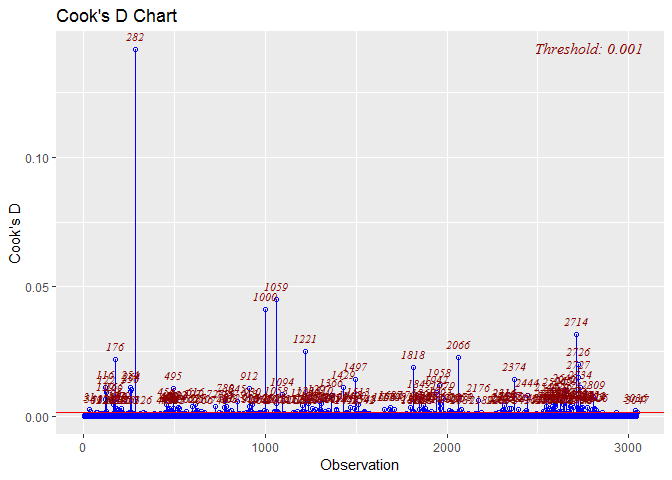

``` r
ols_plot_dffits(fit1)
```

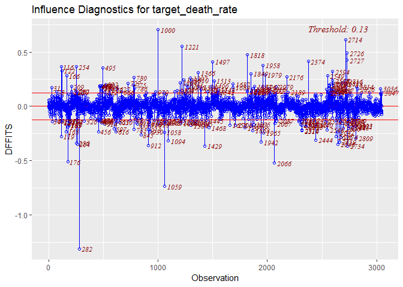

``` r
par(mfrow = c(2,2)) 
plot(fit1)
```

 Based on Cook's distance and DFFITS, number 282, 1000 and 1059 observations are potential influential observations in the dataset.

Based on the diagnostic plots depicted above, we can also treat the number 282, 1000 and 1059 observations as potential influential outliers.

``` r
# Remove potential outlier 282.
raw_1 = raw_data[-c(282,1000, 1059),] 

# Fit a LM model for raw_2 
mult.fit_1 = lm(target_death_rate ~ avg_ann_count + incidence_rate + 
    poverty_percent + median_age_female + pct_hs25_over + pct_bach_deg25_over + 
    pct_unemployed16_over + pct_white + pct_black + pct_other_race + 
    pct_married_households, data = raw_1)

# compare the model of these two
summary(fit1)
```

    ## 
    ## Call:
    ## lm(formula = target_death_rate ~ avg_ann_count + incidence_rate + 
    ##     poverty_percent + median_age_female + pct_hs25_over + pct_bach_deg25_over + 
    ##     pct_unemployed16_over + pct_white + pct_black + pct_other_race + 
    ##     pct_married_households, data = raw_data)
    ## 
    ## Residuals:
    ##      Min       1Q   Median       3Q      Max 
    ## -113.855  -11.308   -0.144   11.205  140.652 
    ## 
    ## Coefficients:
    ##                          Estimate Std. Error t value Pr(>|t|)    
    ## (Intercept)             1.128e+02  9.782e+00  11.527  < 2e-16 ***
    ## avg_ann_count          -5.983e-04  2.816e-04  -2.124 0.033711 *  
    ## incidence_rate          1.980e-01  7.070e-03  28.010  < 2e-16 ***
    ## poverty_percent         6.236e-01  1.026e-01   6.077 1.38e-09 ***
    ## median_age_female      -2.350e-01  7.862e-02  -2.989 0.002821 ** 
    ## pct_hs25_over           4.897e-01  9.060e-02   5.405 6.97e-08 ***
    ## pct_bach_deg25_over    -1.340e+00  1.345e-01  -9.961  < 2e-16 ***
    ## pct_unemployed16_over   7.023e-01  1.474e-01   4.766 1.97e-06 ***
    ## pct_white              -1.267e-01  4.952e-02  -2.559 0.010539 *  
    ## pct_black              -8.936e-02  5.021e-02  -1.780 0.075247 .  
    ## pct_other_race         -7.779e-01  1.250e-01  -6.223 5.55e-10 ***
    ## pct_married_households -2.913e-01  8.116e-02  -3.590 0.000336 ***
    ## ---
    ## Signif. codes:  0 '***' 0.001 '**' 0.01 '*' 0.05 '.' 0.1 ' ' 1
    ## 
    ## Residual standard error: 19.84 on 3035 degrees of freedom
    ## Multiple R-squared:  0.4906, Adjusted R-squared:  0.4887 
    ## F-statistic: 265.7 on 11 and 3035 DF,  p-value: < 2.2e-16

``` r
summary(mult.fit_1)
```

    ## 
    ## Call:
    ## lm(formula = target_death_rate ~ avg_ann_count + incidence_rate + 
    ##     poverty_percent + median_age_female + pct_hs25_over + pct_bach_deg25_over + 
    ##     pct_unemployed16_over + pct_white + pct_black + pct_other_race + 
    ##     pct_married_households, data = raw_1)
    ## 
    ## Residuals:
    ##     Min      1Q  Median      3Q     Max 
    ## -84.934 -11.274  -0.192  11.119 140.129 
    ## 
    ## Coefficients:
    ##                          Estimate Std. Error t value Pr(>|t|)    
    ## (Intercept)             1.078e+02  9.719e+00  11.093  < 2e-16 ***
    ## avg_ann_count          -8.984e-04  3.233e-04  -2.779 0.005486 ** 
    ## incidence_rate          2.060e-01  7.155e-03  28.788  < 2e-16 ***
    ## poverty_percent         6.564e-01  1.020e-01   6.434 1.44e-10 ***
    ## median_age_female      -2.673e-01  7.799e-02  -3.427 0.000618 ***
    ## pct_hs25_over           4.906e-01  8.993e-02   5.456 5.27e-08 ***
    ## pct_bach_deg25_over    -1.274e+00  1.337e-01  -9.527  < 2e-16 ***
    ## pct_unemployed16_over   7.676e-01  1.469e-01   5.226 1.85e-07 ***
    ## pct_white              -1.159e-01  4.911e-02  -2.361 0.018298 *  
    ## pct_black              -9.346e-02  4.975e-02  -1.879 0.060366 .  
    ## pct_other_race         -7.460e-01  1.239e-01  -6.020 1.95e-09 ***
    ## pct_married_households -2.897e-01  8.054e-02  -3.597 0.000327 ***
    ## ---
    ## Signif. codes:  0 '***' 0.001 '**' 0.01 '*' 0.05 '.' 0.1 ' ' 1
    ## 
    ## Residual standard error: 19.66 on 3032 degrees of freedom
    ## Multiple R-squared:  0.4994, Adjusted R-squared:  0.4976 
    ## F-statistic:   275 on 11 and 3032 DF,  p-value: < 2.2e-16

Comparing the model estimates with and without outliers, we have a few observations:

1.  All coefficients have changed, and some of changes are magnitude.

2.  The removal of cases 282, 1000 and 1059 doesn't changes the directionality of the coefficients.

3.  After removing case 282, the standard errors of the coefficients decrease (from 19.84 to 19.66), and the adjusted R square increase (from 0.4887 to 0.4976 ). It is understandable as we have removed an influential/outlier point.

Therefore, we might deal with influential points:

**Checking model assumptions**

Checking for the assumption after removing the outliers:

``` r
par(mfrow = c(2,2)) 
plot(mult.fit_1)
```

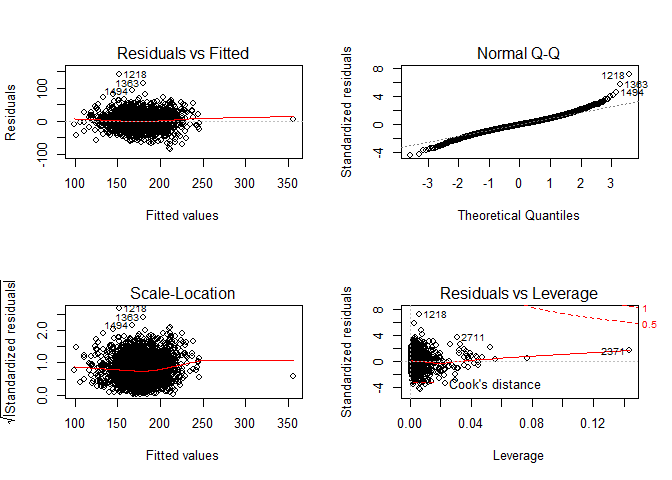

Based on the diagnostic plots depicted above, we can see that that the assumptions hold better when removing outliers.

### Model 2

Through Cp and adjusted R square criteria, we build model with 9 vairables:avg\_ann\_count, incidence\_rate, poverty\_percent, median\_age\_female, pct\_hs25\_over, pct\_bach\_deg25\_over, pct\_unemployed16\_over, pct\_other\_race, pct\_married\_households.

``` r
fit2 = lm(target_death_rate ~ avg_ann_count + incidence_rate + poverty_percent + median_age_female + pct_hs25_over + pct_bach_deg25_over + pct_unemployed16_over + pct_other_race + pct_married_households, data = raw_data)
summary(fit2)
```

    ## 
    ## Call:
    ## lm(formula = target_death_rate ~ avg_ann_count + incidence_rate + 
    ##     poverty_percent + median_age_female + pct_hs25_over + pct_bach_deg25_over + 
    ##     pct_unemployed16_over + pct_other_race + pct_married_households, 
    ##     data = raw_data)
    ## 
    ## Residuals:
    ##      Min       1Q   Median       3Q      Max 
    ## -114.139  -11.354   -0.354   11.046  141.058 
    ## 
    ## Coefficients:
    ##                          Estimate Std. Error t value Pr(>|t|)    
    ## (Intercept)             1.054e+02  9.202e+00  11.453  < 2e-16 ***
    ## avg_ann_count          -5.528e-04  2.813e-04  -1.965 0.049451 *  
    ## incidence_rate          1.960e-01  7.024e-03  27.908  < 2e-16 ***
    ## poverty_percent         6.354e-01  1.017e-01   6.245 4.83e-10 ***
    ## median_age_female      -2.851e-01  7.621e-02  -3.741 0.000187 ***
    ## pct_hs25_over           4.834e-01  9.059e-02   5.336 1.02e-07 ***
    ## pct_bach_deg25_over    -1.314e+00  1.342e-01  -9.788  < 2e-16 ***
    ## pct_unemployed16_over   7.821e-01  1.427e-01   5.479 4.62e-08 ***
    ## pct_other_race         -6.730e-01  1.174e-01  -5.731 1.10e-08 ***
    ## pct_married_households -3.349e-01  7.578e-02  -4.420 1.02e-05 ***
    ## ---
    ## Signif. codes:  0 '***' 0.001 '**' 0.01 '*' 0.05 '.' 0.1 ' ' 1
    ## 
    ## Residual standard error: 19.86 on 3037 degrees of freedom
    ## Multiple R-squared:  0.4895, Adjusted R-squared:  0.4879 
    ## F-statistic: 323.5 on 9 and 3037 DF,  p-value: < 2.2e-16

**outilers**

``` r
# Studentized deleted residuals
stu_res_2 = rstandard(fit2) 


# Rule of thumb cutoff -- 2.5 
outliers_y_2 = stu_res_2[abs(stu_res_2)>2.5] 
outliers_y_2 %>% 
  length()
```

    ## [1] 70

According to rule of thumb, any observation with absolute studentized residual (|ri|) greater than 2.5 may be considered as an outlier Y. In this dataset we have 70 outliers in Y.

``` r
# Get hat matrix values  
state.hat_2 = hatvalues(fit2) 
state.hat_2[state.hat_2 > 0.2] # Cutoff = 0.2
```

    ##      1000 
    ## 0.2604662

``` r
state.hat_2[state.hat_2 > 0.5] # Cutoff = 0.5
```

    ## named numeric(0)

When we use cutoff=0.2, there is 1 leverages in the data, and when we use cutoff = 0.5, there is no leverage in the data. Which means that there 1 moderate leverages in the data, no high leverage in the data.

**influential observations**

``` r
# influential observations
inf_2 = influence.measures(fit2)

ols_plot_cooksd_chart(fit2)
```

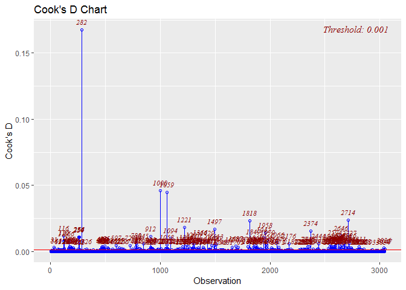

``` r
ols_plot_dffits(fit2)
```

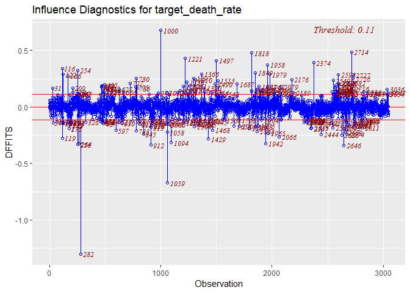

``` r
par(mfrow = c(2,2)) 
plot(fit2)
```

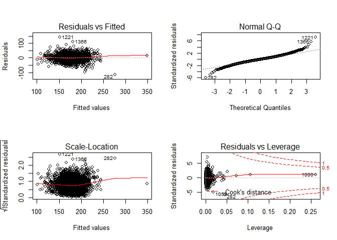

Based on Cook's distance and DFFITS, there are many potential influential observations, but number 282, 1000 and 1059 observations are the most influential ones.

Based on the diagnostic plots depicted above, we can also treat the number 282, 1000 and 1059 observations as a potential influential outliers.

``` r
# Remove potential outlier 282,1000,1059.
raw_2 = raw_data[-c(282,1000,1059),] 

# Fit a LM model for raw_2 
mult.fit_2 = lm(target_death_rate ~ avg_ann_count + incidence_rate + poverty_percent + median_age_female + pct_hs25_over + pct_bach_deg25_over + pct_unemployed16_over + pct_other_race + pct_married_households, data = raw_2)

# compare the model of these two
summary(fit2)
```

    ## 
    ## Call:
    ## lm(formula = target_death_rate ~ avg_ann_count + incidence_rate + 
    ##     poverty_percent + median_age_female + pct_hs25_over + pct_bach_deg25_over + 
    ##     pct_unemployed16_over + pct_other_race + pct_married_households, 
    ##     data = raw_data)
    ## 
    ## Residuals:
    ##      Min       1Q   Median       3Q      Max 
    ## -114.139  -11.354   -0.354   11.046  141.058 
    ## 
    ## Coefficients:
    ##                          Estimate Std. Error t value Pr(>|t|)    
    ## (Intercept)             1.054e+02  9.202e+00  11.453  < 2e-16 ***
    ## avg_ann_count          -5.528e-04  2.813e-04  -1.965 0.049451 *  
    ## incidence_rate          1.960e-01  7.024e-03  27.908  < 2e-16 ***
    ## poverty_percent         6.354e-01  1.017e-01   6.245 4.83e-10 ***
    ## median_age_female      -2.851e-01  7.621e-02  -3.741 0.000187 ***
    ## pct_hs25_over           4.834e-01  9.059e-02   5.336 1.02e-07 ***
    ## pct_bach_deg25_over    -1.314e+00  1.342e-01  -9.788  < 2e-16 ***
    ## pct_unemployed16_over   7.821e-01  1.427e-01   5.479 4.62e-08 ***
    ## pct_other_race         -6.730e-01  1.174e-01  -5.731 1.10e-08 ***
    ## pct_married_households -3.349e-01  7.578e-02  -4.420 1.02e-05 ***
    ## ---
    ## Signif. codes:  0 '***' 0.001 '**' 0.01 '*' 0.05 '.' 0.1 ' ' 1
    ## 
    ## Residual standard error: 19.86 on 3037 degrees of freedom
    ## Multiple R-squared:  0.4895, Adjusted R-squared:  0.4879 
    ## F-statistic: 323.5 on 9 and 3037 DF,  p-value: < 2.2e-16

``` r
summary(mult.fit_2)
```

    ## 
    ## Call:
    ## lm(formula = target_death_rate ~ avg_ann_count + incidence_rate + 
    ##     poverty_percent + median_age_female + pct_hs25_over + pct_bach_deg25_over + 
    ##     pct_unemployed16_over + pct_other_race + pct_married_households, 
    ##     data = raw_2)
    ## 
    ## Residuals:
    ##     Min      1Q  Median      3Q     Max 
    ## -85.280 -11.291  -0.339  11.002 140.162 
    ## 
    ## Coefficients:
    ##                          Estimate Std. Error t value Pr(>|t|)    
    ## (Intercept)             1.005e+02  9.141e+00  10.995  < 2e-16 ***
    ## avg_ann_count          -8.525e-04  3.228e-04  -2.641  0.00832 ** 
    ## incidence_rate          2.040e-01  7.108e-03  28.707  < 2e-16 ***
    ## poverty_percent         6.628e-01  1.011e-01   6.557 6.44e-11 ***
    ## median_age_female      -3.117e-01  7.555e-02  -4.126 3.79e-05 ***
    ## pct_hs25_over           4.866e-01  8.992e-02   5.412 6.73e-08 ***
    ## pct_bach_deg25_over    -1.250e+00  1.334e-01  -9.370  < 2e-16 ***
    ## pct_unemployed16_over   8.330e-01  1.421e-01   5.862 5.07e-09 ***
    ## pct_other_race         -6.465e-01  1.164e-01  -5.556 3.01e-08 ***
    ## pct_married_households -3.196e-01  7.531e-02  -4.243 2.27e-05 ***
    ## ---
    ## Signif. codes:  0 '***' 0.001 '**' 0.01 '*' 0.05 '.' 0.1 ' ' 1
    ## 
    ## Residual standard error: 19.67 on 3034 degrees of freedom
    ## Multiple R-squared:  0.4985, Adjusted R-squared:  0.497 
    ## F-statistic: 335.1 on 9 and 3034 DF,  p-value: < 2.2e-16

Comparing the model estimates with and without outliers, we have a few observations:

1.  All coefficients have changed, and some of changes are magnitude.

2.  The removal of cases 282, 1000 and 1059 doesn't changes the directionality of the coefficients.

3.  After removing case 282, 1000 and 1059, the standard errors of the coefficients decrease (from 19.86 to 19.67), and the adjusted R square increase (from 0.4879 to 0.497 ). It is understandable as we have removed an influential/outlier point.

Therefore, we might deal with influential points:

**Checking model assumptions**

Checking for the assumption after removing the outliers:

``` r
par(mfrow = c(2,2)) 
plot(mult.fit_2)
```

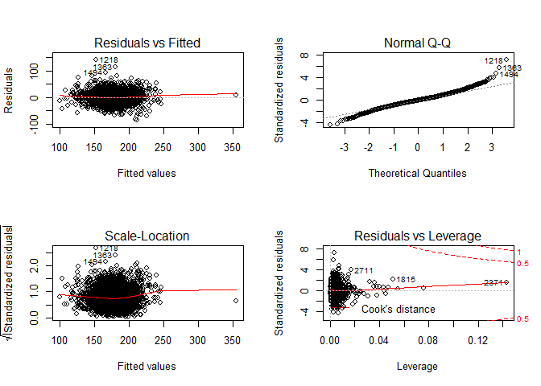

Based on the diagnostic plots depicted above, we can see that that the assumptions hold better when removing outliers.

### Model 3

Through Cp and adjusted R square criteria, we build model with 10 vairables:avg\_ann\_count, incidence\_rate, med\_income, poverty\_percent, median\_age\_female, pct\_hs25\_over, pct\_bach\_deg25\_over,pct\_unemployed16\_over, pct\_other\_race, pct\_married\_households

``` r
fit3 = lm(target_death_rate ~ avg_ann_count + incidence_rate + med_income + poverty_percent + median_age_female + pct_hs25_over + pct_bach_deg25_over + pct_unemployed16_over + pct_other_race + pct_married_households, data = raw_data)
summary(fit3)
```

    ## 
    ## Call:
    ## lm(formula = target_death_rate ~ avg_ann_count + incidence_rate + 
    ##     med_income + poverty_percent + median_age_female + pct_hs25_over + 
    ##     pct_bach_deg25_over + pct_unemployed16_over + pct_other_race + 
    ##     pct_married_households, data = raw_data)
    ## 
    ## Residuals:
    ##      Min       1Q   Median       3Q      Max 
    ## -112.262  -11.268   -0.252   11.115  140.648 
    ## 
    ## Coefficients:
    ##                          Estimate Std. Error t value Pr(>|t|)    
    ## (Intercept)             9.843e+01  9.910e+00   9.933  < 2e-16 ***
    ## avg_ann_count          -6.052e-04  2.825e-04  -2.142  0.03227 *  
    ## incidence_rate          1.951e-01  7.039e-03  27.718  < 2e-16 ***
    ## med_income              1.232e-04  6.528e-05   1.888  0.05912 .  
    ## poverty_percent         7.807e-01  1.276e-01   6.121 1.05e-09 ***
    ## median_age_female      -2.399e-01  7.985e-02  -3.004  0.00268 ** 
    ## pct_hs25_over           4.949e-01  9.076e-02   5.453 5.35e-08 ***
    ## pct_bach_deg25_over    -1.401e+00  1.419e-01  -9.872  < 2e-16 ***
    ## pct_unemployed16_over   7.297e-01  1.453e-01   5.020 5.46e-07 ***
    ## pct_other_race         -6.890e-01  1.177e-01  -5.855 5.29e-09 ***
    ## pct_married_households -3.650e-01  7.740e-02  -4.716 2.52e-06 ***
    ## ---
    ## Signif. codes:  0 '***' 0.001 '**' 0.01 '*' 0.05 '.' 0.1 ' ' 1
    ## 
    ## Residual standard error: 19.85 on 3036 degrees of freedom
    ## Multiple R-squared:  0.4901, Adjusted R-squared:  0.4884 
    ## F-statistic: 291.8 on 10 and 3036 DF,  p-value: < 2.2e-16

**outliers**

``` r
# Studentized deleted residuals
stu_res_3 = rstandard(fit3) 


# Rule of thumb cutoff -- 2.5 
outliers_y_3 = stu_res_3[abs(stu_res_3)>2.5] 
outliers_y_3 %>% 
  length()
```

    ## [1] 69

According to rule of thumb, any observation with absolute studentized residual (|ri|) greater than 2.5 may be considered as an outlier Y. In this dataset we have 69 outliers in Y.

``` r
# Get hat matrix values  
state.hat_3 = hatvalues(fit3) 
state.hat_3[state.hat_3 > 0.2] # Cutoff = 0.2
```

    ##      1000 
    ## 0.2626842

``` r
state.hat_3[state.hat_3 > 0.5] # Cutoff = 0.5
```

    ## named numeric(0)

When we use cutoff=0.2, there is 1 leverages in the data, and when we use cutoff = 0.5, there is no leverage in the data. Which means that there 1 moderate leverages in the data, no high leverage in the data.

**influential observations**

``` r
# influential observations
inf_3 = influence.measures(fit3)

ols_plot_cooksd_chart(fit3)
```

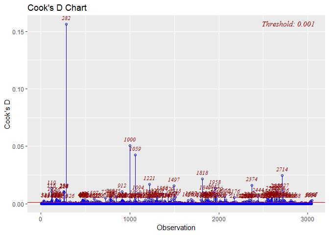

``` r
ols_plot_dffits(fit3)
```

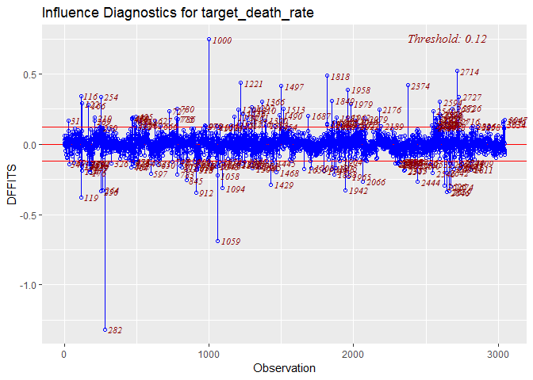

``` r
par(mfrow = c(2,2)) 
plot(fit3)
```

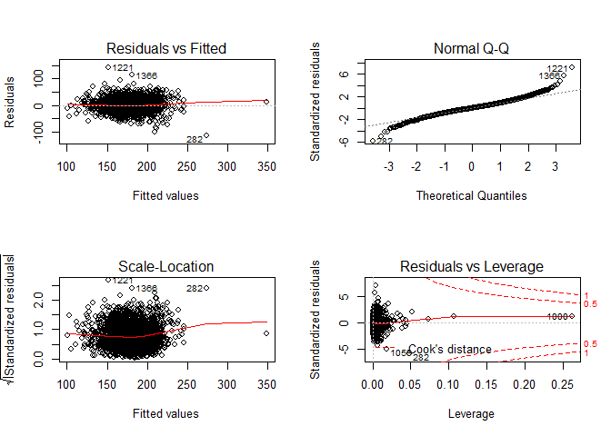

Based on Cook's distance and DFFITS, there are many potential influential observations, but number 282, 1000 and 1059 observations are the most influential ones.

Based on the diagnostic plots depicted above, we can also treat the number 282, 1000 ad 1059 observations as a potential influential outliers.

``` r
# Remove potential outlier 282.
raw_3 = raw_data[-c(282,1000,1059),] 

# Fit a LM model for raw_2 
mult.fit_3 =lm(target_death_rate ~ avg_ann_count + incidence_rate + med_income + poverty_percent + median_age_female + pct_hs25_over + pct_bach_deg25_over + pct_unemployed16_over + pct_other_race + pct_married_households, data = raw_3)

# compare the model of these two
summary(fit3)
```

    ## 
    ## Call:
    ## lm(formula = target_death_rate ~ avg_ann_count + incidence_rate + 
    ##     med_income + poverty_percent + median_age_female + pct_hs25_over + 
    ##     pct_bach_deg25_over + pct_unemployed16_over + pct_other_race + 
    ##     pct_married_households, data = raw_data)
    ## 
    ## Residuals:
    ##      Min       1Q   Median       3Q      Max 
    ## -112.262  -11.268   -0.252   11.115  140.648 
    ## 
    ## Coefficients:
    ##                          Estimate Std. Error t value Pr(>|t|)    
    ## (Intercept)             9.843e+01  9.910e+00   9.933  < 2e-16 ***
    ## avg_ann_count          -6.052e-04  2.825e-04  -2.142  0.03227 *  
    ## incidence_rate          1.951e-01  7.039e-03  27.718  < 2e-16 ***
    ## med_income              1.232e-04  6.528e-05   1.888  0.05912 .  
    ## poverty_percent         7.807e-01  1.276e-01   6.121 1.05e-09 ***
    ## median_age_female      -2.399e-01  7.985e-02  -3.004  0.00268 ** 
    ## pct_hs25_over           4.949e-01  9.076e-02   5.453 5.35e-08 ***
    ## pct_bach_deg25_over    -1.401e+00  1.419e-01  -9.872  < 2e-16 ***
    ## pct_unemployed16_over   7.297e-01  1.453e-01   5.020 5.46e-07 ***
    ## pct_other_race         -6.890e-01  1.177e-01  -5.855 5.29e-09 ***
    ## pct_married_households -3.650e-01  7.740e-02  -4.716 2.52e-06 ***
    ## ---
    ## Signif. codes:  0 '***' 0.001 '**' 0.01 '*' 0.05 '.' 0.1 ' ' 1
    ## 
    ## Residual standard error: 19.85 on 3036 degrees of freedom
    ## Multiple R-squared:  0.4901, Adjusted R-squared:  0.4884 
    ## F-statistic: 291.8 on 10 and 3036 DF,  p-value: < 2.2e-16

``` r
summary(mult.fit_3)
```

    ## 
    ## Call:
    ## lm(formula = target_death_rate ~ avg_ann_count + incidence_rate + 
    ##     med_income + poverty_percent + median_age_female + pct_hs25_over + 
    ##     pct_bach_deg25_over + pct_unemployed16_over + pct_other_race + 
    ##     pct_married_households, data = raw_3)
    ## 
    ## Residuals:
    ##     Min      1Q  Median      3Q     Max 
    ## -85.078 -11.277  -0.375  11.046 139.771 
    ## 
    ## Coefficients:
    ##                          Estimate Std. Error t value Pr(>|t|)    
    ## (Intercept)             9.403e+01  9.835e+00   9.561  < 2e-16 ***
    ## avg_ann_count          -9.160e-04  3.247e-04  -2.821 0.004817 ** 
    ## incidence_rate          2.031e-01  7.126e-03  28.498  < 2e-16 ***
    ## med_income              1.156e-04  6.485e-05   1.782 0.074841 .  
    ## poverty_percent         7.983e-01  1.265e-01   6.312 3.15e-10 ***
    ## median_age_female      -2.693e-01  7.919e-02  -3.401 0.000681 ***
    ## pct_hs25_over           4.975e-01  9.009e-02   5.522 3.63e-08 ***
    ## pct_bach_deg25_over    -1.331e+00  1.409e-01  -9.446  < 2e-16 ***
    ## pct_unemployed16_over   7.852e-01  1.446e-01   5.432 6.02e-08 ***
    ## pct_other_race         -6.614e-01  1.166e-01  -5.671 1.55e-08 ***
    ## pct_married_households -3.481e-01  7.697e-02  -4.523 6.33e-06 ***
    ## ---
    ## Signif. codes:  0 '***' 0.001 '**' 0.01 '*' 0.05 '.' 0.1 ' ' 1
    ## 
    ## Residual standard error: 19.66 on 3033 degrees of freedom
    ## Multiple R-squared:  0.499,  Adjusted R-squared:  0.4973 
    ## F-statistic: 302.1 on 10 and 3033 DF,  p-value: < 2.2e-16

``` r
table = broom::tidy(fit3)
table2 = broom::tidy(mult.fit_3)
tibble(
  term = table$term,
   estimate_with = table$estimate,
  estiamte_without = table2$estimate
    ) %>% 
   knitr::kable(digits = 3)
```

| term                     |  estimate\_with|  estiamte\_without|
|:-------------------------|---------------:|------------------:|
| (Intercept)              |          98.432|             94.030|
| avg\_ann\_count          |          -0.001|             -0.001|
| incidence\_rate          |           0.195|              0.203|
| med\_income              |           0.000|              0.000|
| poverty\_percent         |           0.781|              0.798|
| median\_age\_female      |          -0.240|             -0.269|
| pct\_hs25\_over          |           0.495|              0.498|
| pct\_bach\_deg25\_over   |          -1.401|             -1.331|
| pct\_unemployed16\_over  |           0.730|              0.785|
| pct\_other\_race         |          -0.689|             -0.661|
| pct\_married\_households |          -0.365|             -0.348|

``` r
tibble(
  term = c("with", "without"),
  residual_standard_error = c(19.85, 19.66),
  Adjusted_R_squared = c(0.4884, 0.4973)
) %>% 
  knitr::kable(digits = 3)
```

| term    |  residual\_standard\_error|  Adjusted\_R\_squared|
|:--------|--------------------------:|---------------------:|
| with    |                      19.85|                 0.488|
| without |                      19.66|                 0.497|

Comparing the model estimates with and without outliers, we have a few observations:

1.  All coefficients have changed, and some of changes are magnitude.

2.  The removal of case 282, 1000 and 1059 doesn't changes the directionality of the coefficients.

3.  After removing case 282, 1000 and 1059, the standard errors of the coefficients decrease (from 19.85 to 19.66), and the adjusted R square increase (from 0.4884 to 0.4973 ). It is understandable as we have removed an influential/outlier point.

Therefore, we might deal with influential points:

**Checking model assumptions**

Checking for the assumption after removing the outliers:

``` r
par(mfrow = c(2,2)) 
plot(mult.fit_3)
```

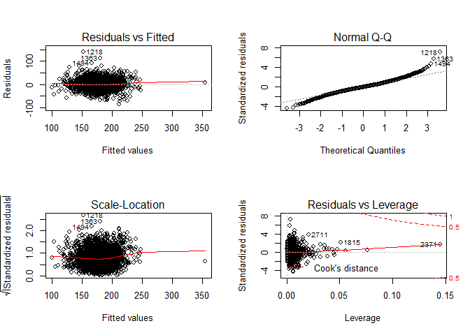

Based on the diagnostic plots depicted above, we can see that that the assumptions hold better when removing outliers.

Cross Validation
----------------

**Cross validation of model 1**

``` r
library(caret)
```

    ## Loading required package: lattice

    ## 
    ## Attaching package: 'lattice'

    ## The following object is masked from 'package:boot':
    ## 
    ##     melanoma

    ## 
    ## Attaching package: 'caret'

    ## The following object is masked from 'package:purrr':
    ## 
    ##     lift

``` r
data_train = trainControl(method = "repeatedcv", number = 5, repeats = 10)
model_caret1 = train(target_death_rate ~ avg_ann_count + incidence_rate + 
    poverty_percent + median_age_female + pct_hs25_over + pct_bach_deg25_over + 
    pct_unemployed16_over + pct_white + pct_black + pct_other_race + 
    pct_married_households, data = raw_data,
                   trControl=data_train,
                   method='lm',
                   na.action=na.pass)
model_caret1                                            # RMSE and Rsquare of model 1 #
```

    ## Linear Regression 
    ## 
    ## 3047 samples
    ##   11 predictor
    ## 
    ## No pre-processing
    ## Resampling: Cross-Validated (5 fold, repeated 10 times) 
    ## Summary of sample sizes: 2439, 2436, 2438, 2437, 2438, 2436, ... 
    ## Resampling results:
    ## 
    ##   RMSE      Rsquared   MAE     
    ##   19.91687  0.4854881  14.86754
    ## 
    ## Tuning parameter 'intercept' was held constant at a value of TRUE

-   From the 5-fold cross validation, the RMSE for the 11-variable model is about 19.87598.

**Cross validation of model 2**

``` r
model_caret2 = train(target_death_rate ~ avg_ann_count + incidence_rate + poverty_percent + median_age_female +   pct_hs25_over + pct_bach_deg25_over + pct_unemployed16_over + pct_other_race + pct_married_households, data = raw_data,
                     

                   trControl=data_train,
                   method='lm',
                   na.action=na.pass)
model_caret2                                             # RMSE and Rsquare of model 2 #
```

    ## Linear Regression 
    ## 
    ## 3047 samples
    ##    9 predictor
    ## 
    ## No pre-processing
    ## Resampling: Cross-Validated (5 fold, repeated 10 times) 
    ## Summary of sample sizes: 2438, 2435, 2439, 2438, 2438, 2437, ... 
    ## Resampling results:
    ## 
    ##   RMSE      Rsquared   MAE     
    ##   19.91974  0.4849104  14.87055
    ## 
    ## Tuning parameter 'intercept' was held constant at a value of TRUE

**Cross validation of model 3**

``` r
model_caret3 = train(target_death_rate ~ avg_ann_count + incidence_rate + med_income + poverty_percent + median_age_female + pct_hs25_over + pct_bach_deg25_over + pct_unemployed16_over + pct_other_race + pct_married_households, data = raw_data,
                     

                   trControl=data_train,
                   method='lm',
                   na.action=na.pass)
model_caret3                                             # RMSE and Rsquare of model 3 #
```

    ## Linear Regression 
    ## 
    ## 3047 samples
    ##   10 predictor
    ## 
    ## No pre-processing
    ## Resampling: Cross-Validated (5 fold, repeated 10 times) 
    ## Summary of sample sizes: 2437, 2437, 2438, 2438, 2438, 2436, ... 
    ## Resampling results:
    ## 
    ##   RMSE      Rsquared   MAE     
    ##   19.90811  0.4857715  14.83928
    ## 
    ## Tuning parameter 'intercept' was held constant at a value of TRUE

-   From the 5-fold cross validation, the RMSE for the three models are pretty similar.

Bootstrap
---------

**Bootstrap of model 1**

``` r
boot.fn = function(data, index){
    return(coef(lm(target_death_rate ~ avg_ann_count + incidence_rate + 
    poverty_percent + median_age_female + pct_hs25_over + pct_bach_deg25_over + 
    pct_unemployed16_over + pct_white + pct_black + pct_other_race + 
    pct_married_households, data = raw_data, subset=index)))
}
set.seed(1)
boot11=boot(raw_data, boot.fn, 10000)
boot11_tidy=tidy(boot11)
mean(boot11_tidy$bias)
```

    ## [1] -0.004884799

``` r
mean(boot11_tidy$std.error)               # mean bias and sd for model 1 #
```

    ## [1] 1.130276

**Bootstrap of model 2**

``` r
boot.fn2 = function(data, index){
    return(coef(lm(target_death_rate ~ avg_ann_count + incidence_rate + poverty_percent + median_age_female + pct_hs25_over + pct_bach_deg25_over + pct_unemployed16_over + pct_other_race + pct_married_households, data = raw_data, subset=index)))
}
set.seed(1)
boot9=boot(raw_data, boot.fn2, 10000)
boot9_tidy=tidy(boot9)
mean(boot9_tidy$bias)
```

    ## [1] -0.003316342

``` r
mean(boot9_tidy$std.error)                # mean bias and sd for model 2 #
```

    ## [1] 1.200722

**Bootstrap of model 3**

``` r
boot.fn3 = function(data, index){
    return(coef(lm(target_death_rate ~ avg_ann_count + incidence_rate + med_income + poverty_percent + median_age_female + pct_hs25_over + pct_bach_deg25_over + pct_unemployed16_over + pct_other_race + pct_married_households, data = raw_data, subset=index)))
}
set.seed(1)
boot10=boot(raw_data, boot.fn3, 10000)
boot10_tidy=tidy(boot10)
mean(boot10_tidy$bias)
```

    ## [1] -0.001379811

``` r
mean(boot10_tidy$std.error)               # mean bias and sd for model 3 #
```

    ## [1] 1.105661

``` r
raw_data2 = raw_data %>%
 mutate(pct_other_race_1 = ifelse(pct_other_race > 0.8262, 1, 0))
```

``` r
fit2 = lm(target_death_rate ~ avg_ann_count + incidence_rate + poverty_percent + median_age_female + pct_hs25_over + pct_bach_deg25_over + pct_unemployed16_over + pct_other_race + pct_married_households, data = raw_data)
summary(fit2)
```

    ## 
    ## Call:
    ## lm(formula = target_death_rate ~ avg_ann_count + incidence_rate + 
    ##     poverty_percent + median_age_female + pct_hs25_over + pct_bach_deg25_over + 
    ##     pct_unemployed16_over + pct_other_race + pct_married_households, 
    ##     data = raw_data)
    ## 
    ## Residuals:
    ##      Min       1Q   Median       3Q      Max 
    ## -114.139  -11.354   -0.354   11.046  141.058 
    ## 
    ## Coefficients:
    ##                          Estimate Std. Error t value Pr(>|t|)    
    ## (Intercept)             1.054e+02  9.202e+00  11.453  < 2e-16 ***
    ## avg_ann_count          -5.528e-04  2.813e-04  -1.965 0.049451 *  
    ## incidence_rate          1.960e-01  7.024e-03  27.908  < 2e-16 ***
    ## poverty_percent         6.354e-01  1.017e-01   6.245 4.83e-10 ***
    ## median_age_female      -2.851e-01  7.621e-02  -3.741 0.000187 ***
    ## pct_hs25_over           4.834e-01  9.059e-02   5.336 1.02e-07 ***
    ## pct_bach_deg25_over    -1.314e+00  1.342e-01  -9.788  < 2e-16 ***
    ## pct_unemployed16_over   7.821e-01  1.427e-01   5.479 4.62e-08 ***
    ## pct_other_race         -6.730e-01  1.174e-01  -5.731 1.10e-08 ***
    ## pct_married_households -3.349e-01  7.578e-02  -4.420 1.02e-05 ***
    ## ---
    ## Signif. codes:  0 '***' 0.001 '**' 0.01 '*' 0.05 '.' 0.1 ' ' 1
    ## 
    ## Residual standard error: 19.86 on 3037 degrees of freedom
    ## Multiple R-squared:  0.4895, Adjusted R-squared:  0.4879 
    ## F-statistic: 323.5 on 9 and 3037 DF,  p-value: < 2.2e-16

``` r
fit2_bin = lm(target_death_rate ~ avg_ann_count + incidence_rate + poverty_percent + median_age_female + pct_hs25_over + pct_bach_deg25_over + pct_unemployed16_over + pct_other_race_1 + pct_married_households, data = raw_data2)
summary(fit2_bin)
```

    ## 
    ## Call:
    ## lm(formula = target_death_rate ~ avg_ann_count + incidence_rate + 
    ##     poverty_percent + median_age_female + pct_hs25_over + pct_bach_deg25_over + 
    ##     pct_unemployed16_over + pct_other_race_1 + pct_married_households, 
    ##     data = raw_data2)
    ## 
    ## Residuals:
    ##      Min       1Q   Median       3Q      Max 
    ## -117.321  -11.484   -0.227   11.260  142.115 
    ## 
    ## Coefficients:
    ##                          Estimate Std. Error t value Pr(>|t|)    
    ## (Intercept)            95.8434519  9.1561417  10.468  < 2e-16 ***
    ## avg_ann_count          -0.0008095  0.0002777  -2.915  0.00358 ** 
    ## incidence_rate          0.2017466  0.0069587  28.992  < 2e-16 ***
    ## poverty_percent         0.6388390  0.1024007   6.239 5.03e-10 ***
    ## median_age_female      -0.2406558  0.0764833  -3.147  0.00167 ** 
    ## pct_hs25_over           0.5682237  0.0904472   6.282 3.81e-10 ***
    ## pct_bach_deg25_over    -1.1662794  0.1315128  -8.868  < 2e-16 ***
    ## pct_unemployed16_over   0.8351130  0.1431375   5.834 5.97e-09 ***
    ## pct_other_race_1       -2.2869395  0.8107649  -2.821  0.00482 ** 
    ## pct_married_households -0.3408406  0.0761237  -4.477 7.83e-06 ***
    ## ---
    ## Signif. codes:  0 '***' 0.001 '**' 0.01 '*' 0.05 '.' 0.1 ' ' 1
    ## 
    ## Residual standard error: 19.94 on 3037 degrees of freedom
    ## Multiple R-squared:  0.4853, Adjusted R-squared:  0.4838 
    ## F-statistic: 318.2 on 9 and 3037 DF,  p-value: < 2.2e-16

-   From the previous two rmd we know that we should choose the model 2 according to parsimony. Now we want to try interaction based on model 2. We recode the pct\_other\_race to 0 and 1 based on median. 0 indicates fewer other race people in this county, and 1 indicates more other race people in this county. We try to interact the new variable pct\_other\_race\_1 to other predictors one by one and see if there is association between race and these predictors.

``` r
try1 = lm(target_death_rate ~ avg_ann_count + incidence_rate + poverty_percent + median_age_female + pct_hs25_over + pct_bach_deg25_over + pct_unemployed16_over + pct_married_households + pct_other_race_1 + pct_other_race_1 * avg_ann_count, data = raw_data2)
summary(try1)
```

    ## 
    ## Call:
    ## lm(formula = target_death_rate ~ avg_ann_count + incidence_rate + 
    ##     poverty_percent + median_age_female + pct_hs25_over + pct_bach_deg25_over + 
    ##     pct_unemployed16_over + pct_married_households + pct_other_race_1 + 
    ##     pct_other_race_1 * avg_ann_count, data = raw_data2)
    ## 
    ## Residuals:
    ##      Min       1Q   Median       3Q      Max 
    ## -117.966  -11.488   -0.336   11.342  142.025 
    ## 
    ## Coefficients:
    ##                                  Estimate Std. Error t value Pr(>|t|)    
    ## (Intercept)                    96.9358352  9.1863700  10.552  < 2e-16 ***
    ## avg_ann_count                  -0.0019203  0.0008248  -2.328  0.01996 *  
    ## incidence_rate                  0.2021858  0.0069642  29.032  < 2e-16 ***
    ## poverty_percent                 0.6280222  0.1026620   6.117 1.07e-09 ***
    ## median_age_female              -0.2408542  0.0764703  -3.150  0.00165 ** 
    ## pct_hs25_over                   0.5615072  0.0905534   6.201 6.38e-10 ***
    ## pct_bach_deg25_over            -1.1701008  0.1315173  -8.897  < 2e-16 ***
    ## pct_unemployed16_over           0.8239888  0.1433240   5.749 9.86e-09 ***
    ## pct_married_households         -0.3468538  0.0762266  -4.550 5.57e-06 ***
    ## pct_other_race_1               -2.8132826  0.8902454  -3.160  0.00159 ** 
    ## avg_ann_count:pct_other_race_1  0.0012236  0.0008555   1.430  0.15274    
    ## ---
    ## Signif. codes:  0 '***' 0.001 '**' 0.01 '*' 0.05 '.' 0.1 ' ' 1
    ## 
    ## Residual standard error: 19.94 on 3036 degrees of freedom
    ## Multiple R-squared:  0.4856, Adjusted R-squared:  0.4839 
    ## F-statistic: 286.6 on 10 and 3036 DF,  p-value: < 2.2e-16

-   First we try race and avg\_ann\_count. The p-value is 0.153.

``` r
try2 = lm(target_death_rate ~ avg_ann_count + incidence_rate + poverty_percent + median_age_female + pct_hs25_over + pct_bach_deg25_over + pct_unemployed16_over + pct_married_households + pct_other_race_1 + pct_other_race_1 * incidence_rate, data = raw_data2)
summary(try2)
```

    ## 
    ## Call:
    ## lm(formula = target_death_rate ~ avg_ann_count + incidence_rate + 
    ##     poverty_percent + median_age_female + pct_hs25_over + pct_bach_deg25_over + 
    ##     pct_unemployed16_over + pct_married_households + pct_other_race_1 + 
    ##     pct_other_race_1 * incidence_rate, data = raw_data2)
    ## 
    ## Residuals:
    ##      Min       1Q   Median       3Q      Max 
    ## -105.665  -11.539   -0.226   11.306  141.583 
    ## 
    ## Coefficients:
    ##                                   Estimate Std. Error t value Pr(>|t|)    
    ## (Intercept)                      1.064e+02  9.725e+00  10.943  < 2e-16 ***
    ## avg_ann_count                   -8.377e-04  2.774e-04  -3.020 0.002551 ** 
    ## incidence_rate                   1.803e-01  9.671e-03  18.642  < 2e-16 ***
    ## poverty_percent                  6.696e-01  1.027e-01   6.520 8.20e-11 ***
    ## median_age_female               -2.554e-01  7.651e-02  -3.338 0.000853 ***
    ## pct_hs25_over                    5.428e-01  9.066e-02   5.987 2.39e-09 ***
    ## pct_bach_deg25_over             -1.191e+00  1.315e-01  -9.054  < 2e-16 ***
    ## pct_unemployed16_over            8.088e-01  1.432e-01   5.650 1.75e-08 ***
    ## pct_married_households          -3.256e-01  7.616e-02  -4.275 1.97e-05 ***
    ## pct_other_race_1                -2.179e+01  6.166e+00  -3.533 0.000417 ***
    ## incidence_rate:pct_other_race_1  4.329e-02  1.357e-02   3.190 0.001438 ** 
    ## ---
    ## Signif. codes:  0 '***' 0.001 '**' 0.01 '*' 0.05 '.' 0.1 ' ' 1
    ## 
    ## Residual standard error: 19.91 on 3036 degrees of freedom
    ## Multiple R-squared:  0.487,  Adjusted R-squared:  0.4853 
    ## F-statistic: 288.2 on 10 and 3036 DF,  p-value: < 2.2e-16

-   The p-value for pct\_other\_race\_1 \* incidence\_rate is 0.0014, indicating the race modifies the relationship between incidece rate and target mortality rate.

``` r
try3 = lm(target_death_rate ~ avg_ann_count + incidence_rate + poverty_percent + median_age_female + pct_hs25_over + pct_bach_deg25_over + pct_unemployed16_over + pct_married_households + pct_other_race_1 + pct_other_race_1 * poverty_percent, data = raw_data2)
summary(try3)
```

    ## 
    ## Call:
    ## lm(formula = target_death_rate ~ avg_ann_count + incidence_rate + 
    ##     poverty_percent + median_age_female + pct_hs25_over + pct_bach_deg25_over + 
    ##     pct_unemployed16_over + pct_married_households + pct_other_race_1 + 
    ##     pct_other_race_1 * poverty_percent, data = raw_data2)
    ## 
    ## Residuals:
    ##     Min      1Q  Median      3Q     Max 
    ## -115.02  -11.44   -0.05   11.26  141.07 
    ## 
    ## Coefficients:
    ##                                    Estimate Std. Error t value Pr(>|t|)
    ## (Intercept)                      94.4494705  9.0916447  10.389  < 2e-16
    ## avg_ann_count                    -0.0008183  0.0002756  -2.969  0.00301
    ## incidence_rate                    0.1968358  0.0069459  28.339  < 2e-16
    ## poverty_percent                   1.0000739  0.1148089   8.711  < 2e-16
    ## median_age_female                -0.2207619  0.0759820  -2.905  0.00369
    ## pct_hs25_over                     0.5632461  0.0897900   6.273 4.05e-10
    ## pct_bach_deg25_over              -1.2211542  0.1308043  -9.336  < 2e-16
    ## pct_unemployed16_over             0.7261620  0.1430013   5.078 4.04e-07
    ## pct_married_households           -0.3728734  0.0757161  -4.925 8.90e-07
    ## pct_other_race_1                 10.8260327  2.0976723   5.161 2.61e-07
    ## poverty_percent:pct_other_race_1 -0.7724087  0.1141047  -6.769 1.55e-11
    ##                                     
    ## (Intercept)                      ***
    ## avg_ann_count                    ** 
    ## incidence_rate                   ***
    ## poverty_percent                  ***
    ## median_age_female                ** 
    ## pct_hs25_over                    ***
    ## pct_bach_deg25_over              ***
    ## pct_unemployed16_over            ***
    ## pct_married_households           ***
    ## pct_other_race_1                 ***
    ## poverty_percent:pct_other_race_1 ***
    ## ---
    ## Signif. codes:  0 '***' 0.001 '**' 0.01 '*' 0.05 '.' 0.1 ' ' 1
    ## 
    ## Residual standard error: 19.79 on 3036 degrees of freedom
    ## Multiple R-squared:  0.4929, Adjusted R-squared:  0.4913 
    ## F-statistic: 295.1 on 10 and 3036 DF,  p-value: < 2.2e-16

-   P-value is very small, R square increase a lot.

``` r
try4 = lm(target_death_rate ~ avg_ann_count + incidence_rate + poverty_percent + median_age_female + pct_hs25_over + pct_bach_deg25_over + pct_unemployed16_over + pct_married_households + pct_other_race_1 + pct_other_race_1 * pct_hs25_over, data = raw_data2)
summary(try4)
```

    ## 
    ## Call:
    ## lm(formula = target_death_rate ~ avg_ann_count + incidence_rate + 
    ##     poverty_percent + median_age_female + pct_hs25_over + pct_bach_deg25_over + 
    ##     pct_unemployed16_over + pct_married_households + pct_other_race_1 + 
    ##     pct_other_race_1 * pct_hs25_over, data = raw_data2)
    ## 
    ## Residuals:
    ##      Min       1Q   Median       3Q      Max 
    ## -118.577  -11.413   -0.096   11.237  143.179 
    ## 
    ## Coefficients:
    ##                                  Estimate Std. Error t value Pr(>|t|)    
    ## (Intercept)                    98.1578767  9.3684351  10.478  < 2e-16 ***
    ## avg_ann_count                  -0.0007630  0.0002805  -2.720  0.00656 ** 
    ## incidence_rate                  0.2012442  0.0069716  28.866  < 2e-16 ***
    ## poverty_percent                 0.6366589  0.1024118   6.217 5.77e-10 ***
    ## median_age_female              -0.2454882  0.0765911  -3.205  0.00136 ** 
    ## pct_hs25_over                   0.5075886  0.1043350   4.865 1.20e-06 ***
    ## pct_bach_deg25_over            -1.1552495  0.1318450  -8.762  < 2e-16 ***
    ## pct_unemployed16_over           0.8510945  0.1437842   5.919 3.60e-09 ***
    ## pct_married_households         -0.3378887  0.0761613  -4.436 9.47e-06 ***
    ## pct_other_race_1               -6.9121788  4.0500438  -1.707  0.08798 .  
    ## pct_hs25_over:pct_other_race_1  0.1317460  0.1130272   1.166  0.24386    
    ## ---
    ## Signif. codes:  0 '***' 0.001 '**' 0.01 '*' 0.05 '.' 0.1 ' ' 1
    ## 
    ## Residual standard error: 19.94 on 3036 degrees of freedom
    ## Multiple R-squared:  0.4855, Adjusted R-squared:  0.4838 
    ## F-statistic: 286.5 on 10 and 3036 DF,  p-value: < 2.2e-16

-   P-value is too big.

``` r
try5 = lm(target_death_rate ~ avg_ann_count + incidence_rate + poverty_percent + median_age_female + pct_hs25_over + pct_bach_deg25_over + pct_unemployed16_over + pct_married_households + pct_other_race_1 + pct_other_race_1 * pct_bach_deg25_over, data = raw_data2)
summary(try5)
```

    ## 
    ## Call:
    ## lm(formula = target_death_rate ~ avg_ann_count + incidence_rate + 
    ##     poverty_percent + median_age_female + pct_hs25_over + pct_bach_deg25_over + 
    ##     pct_unemployed16_over + pct_married_households + pct_other_race_1 + 
    ##     pct_other_race_1 * pct_bach_deg25_over, data = raw_data2)
    ## 
    ## Residuals:
    ##      Min       1Q   Median       3Q      Max 
    ## -111.432  -11.202   -0.383   11.248  138.479 
    ## 
    ## Coefficients:
    ##                                        Estimate Std. Error t value
    ## (Intercept)                           1.041e+02  9.301e+00  11.187
    ## avg_ann_count                        -9.695e-04  2.790e-04  -3.475
    ## incidence_rate                        2.007e-01  6.940e-03  28.914
    ## poverty_percent                       6.278e-01  1.021e-01   6.149
    ## median_age_female                    -2.395e-01  7.623e-02  -3.142
    ## pct_hs25_over                         5.399e-01  9.036e-02   5.975
    ## pct_bach_deg25_over                  -1.577e+00  1.589e-01  -9.924
    ## pct_unemployed16_over                 7.532e-01  1.438e-01   5.238
    ## pct_married_households               -3.554e-01  7.594e-02  -4.680
    ## pct_other_race_1                     -1.071e+01  2.012e+00  -5.324
    ## pct_bach_deg25_over:pct_other_race_1  6.411e-01  1.402e-01   4.572
    ##                                      Pr(>|t|)    
    ## (Intercept)                           < 2e-16 ***
    ## avg_ann_count                        0.000518 ***
    ## incidence_rate                        < 2e-16 ***
    ## poverty_percent                      8.81e-10 ***
    ## median_age_female                    0.001695 ** 
    ## pct_hs25_over                        2.57e-09 ***
    ## pct_bach_deg25_over                   < 2e-16 ***
    ## pct_unemployed16_over                1.73e-07 ***
    ## pct_married_households               2.99e-06 ***
    ## pct_other_race_1                     1.09e-07 ***
    ## pct_bach_deg25_over:pct_other_race_1 5.02e-06 ***
    ## ---
    ## Signif. codes:  0 '***' 0.001 '**' 0.01 '*' 0.05 '.' 0.1 ' ' 1
    ## 
    ## Residual standard error: 19.87 on 3036 degrees of freedom
    ## Multiple R-squared:  0.4888, Adjusted R-squared:  0.4871 
    ## F-statistic: 290.3 on 10 and 3036 DF,  p-value: < 2.2e-16

-   P-value is small.

``` r
try6 = lm(target_death_rate ~ avg_ann_count + incidence_rate + poverty_percent + median_age_female + pct_hs25_over + pct_bach_deg25_over + pct_unemployed16_over + pct_married_households + pct_other_race_1 + pct_other_race_1 * pct_unemployed16_over, data = raw_data2)
summary(try6)
```

    ## 
    ## Call:
    ## lm(formula = target_death_rate ~ avg_ann_count + incidence_rate + 
    ##     poverty_percent + median_age_female + pct_hs25_over + pct_bach_deg25_over + 
    ##     pct_unemployed16_over + pct_married_households + pct_other_race_1 + 
    ##     pct_other_race_1 * pct_unemployed16_over, data = raw_data2)
    ## 
    ## Residuals:
    ##      Min       1Q   Median       3Q      Max 
    ## -116.768  -11.426   -0.171   10.973  140.329 
    ## 
    ## Coefficients:
    ##                                          Estimate Std. Error t value
    ## (Intercept)                            92.2811435  9.1257607  10.112
    ## avg_ann_count                          -0.0007306  0.0002765  -2.643
    ## incidence_rate                          0.2009962  0.0069215  29.039
    ## poverty_percent                         0.6182960  0.1018964   6.068
    ## median_age_female                      -0.2011279  0.0763573  -2.634
    ## pct_hs25_over                           0.5489587  0.0900084   6.099
    ## pct_bach_deg25_over                    -1.1876158  0.1308386  -9.077
    ## pct_unemployed16_over                   1.3789601  0.1696465   8.128
    ## pct_married_households                 -0.3547688  0.0757414  -4.684
    ## pct_other_race_1                        7.5520745  1.8540877   4.073
    ## pct_unemployed16_over:pct_other_race_1 -1.2498679  0.2120907  -5.893
    ##                                        Pr(>|t|)    
    ## (Intercept)                             < 2e-16 ***
    ## avg_ann_count                           0.00827 ** 
    ## incidence_rate                          < 2e-16 ***
    ## poverty_percent                        1.46e-09 ***
    ## median_age_female                       0.00848 ** 
    ## pct_hs25_over                          1.20e-09 ***
    ## pct_bach_deg25_over                     < 2e-16 ***
    ## pct_unemployed16_over                  6.26e-16 ***
    ## pct_married_households                 2.94e-06 ***
    ## pct_other_race_1                       4.76e-05 ***
    ## pct_unemployed16_over:pct_other_race_1 4.21e-09 ***
    ## ---
    ## Signif. codes:  0 '***' 0.001 '**' 0.01 '*' 0.05 '.' 0.1 ' ' 1
    ## 
    ## Residual standard error: 19.83 on 3036 degrees of freedom
    ## Multiple R-squared:  0.4911, Adjusted R-squared:  0.4894 
    ## F-statistic:   293 on 10 and 3036 DF,  p-value: < 2.2e-16

-   P-value is very small, R square increase a lot.

``` r
try7 = lm(target_death_rate ~ avg_ann_count + incidence_rate + poverty_percent + median_age_female + pct_hs25_over + pct_bach_deg25_over + pct_unemployed16_over + pct_married_households + pct_other_race_1 + pct_other_race_1 * pct_married_households, data = raw_data2)
summary(try7)
```

    ## 
    ## Call:
    ## lm(formula = target_death_rate ~ avg_ann_count + incidence_rate + 
    ##     poverty_percent + median_age_female + pct_hs25_over + pct_bach_deg25_over + 
    ##     pct_unemployed16_over + pct_married_households + pct_other_race_1 + 
    ##     pct_other_race_1 * pct_married_households, data = raw_data2)
    ## 
    ## Residuals:
    ##     Min      1Q  Median      3Q     Max 
    ## -117.22  -11.48   -0.24   11.25  142.11 
    ## 
    ## Coefficients:
    ##                                           Estimate Std. Error t value
    ## (Intercept)                             95.2982464  9.8066779   9.718
    ## avg_ann_count                           -0.0008130  0.0002786  -2.918
    ## incidence_rate                           0.2017879  0.0069648  28.972
    ## poverty_percent                          0.6397755  0.1025943   6.236
    ## median_age_female                       -0.2417454  0.0768163  -3.147
    ## pct_hs25_over                            0.5679408  0.0904800   6.277
    ## pct_bach_deg25_over                     -1.1659866  0.1315474  -8.864
    ## pct_unemployed16_over                    0.8366864  0.1435181   5.830
    ## pct_married_households                  -0.3300950  0.1028507  -3.209
    ## pct_other_race_1                        -1.3895188  5.8316033  -0.238
    ## pct_married_households:pct_other_race_1 -0.0175540  0.1129607  -0.155
    ##                                         Pr(>|t|)    
    ## (Intercept)                              < 2e-16 ***
    ## avg_ann_count                            0.00355 ** 
    ## incidence_rate                           < 2e-16 ***
    ## poverty_percent                         5.11e-10 ***
    ## median_age_female                        0.00167 ** 
    ## pct_hs25_over                           3.94e-10 ***
    ## pct_bach_deg25_over                      < 2e-16 ***
    ## pct_unemployed16_over                   6.13e-09 ***
    ## pct_married_households                   0.00134 ** 
    ## pct_other_race_1                         0.81168    
    ## pct_married_households:pct_other_race_1  0.87652    
    ## ---
    ## Signif. codes:  0 '***' 0.001 '**' 0.01 '*' 0.05 '.' 0.1 ' ' 1
    ## 
    ## Residual standard error: 19.94 on 3036 degrees of freedom
    ## Multiple R-squared:  0.4853, Adjusted R-squared:  0.4836 
    ## F-statistic: 286.2 on 10 and 3036 DF,  p-value: < 2.2e-16

-   P-value is very large.

``` r
final_model = lm(target_death_rate ~ avg_ann_count + incidence_rate + poverty_percent + median_age_female + pct_hs25_over + pct_bach_deg25_over + pct_unemployed16_over + pct_married_households + pct_other_race_1 + pct_other_race_1 * pct_married_households + pct_other_race_1 * poverty_percent, data = raw_data2)
summary(final_model) 
```

    ## 
    ## Call:
    ## lm(formula = target_death_rate ~ avg_ann_count + incidence_rate + 
    ##     poverty_percent + median_age_female + pct_hs25_over + pct_bach_deg25_over + 
    ##     pct_unemployed16_over + pct_married_households + pct_other_race_1 + 
    ##     pct_other_race_1 * pct_married_households + pct_other_race_1 * 
    ##     poverty_percent, data = raw_data2)
    ## 
    ## Residuals:
    ##      Min       1Q   Median       3Q      Max 
    ## -109.044  -11.429   -0.033   11.362  140.252 
    ## 
    ## Coefficients:
    ##                                           Estimate Std. Error t value
    ## (Intercept)                             69.6007020 10.1252191   6.874
    ## avg_ann_count                           -0.0009787  0.0002759  -3.547
    ## incidence_rate                           0.1955912  0.0069168  28.278
    ## poverty_percent                          1.2663533  0.1242058  10.196
    ## median_age_female                       -0.2562935  0.0759012  -3.377
    ## pct_hs25_over                            0.5477020  0.0894107   6.126
    ## pct_bach_deg25_over                     -1.2424702  0.1302442  -9.540
    ## pct_unemployed16_over                    0.7274812  0.1423254   5.111
    ## pct_married_households                   0.0798017  0.1119338   0.713
    ## pct_other_race_1                        58.4686944  8.9576355   6.527
    ## pct_married_households:pct_other_race_1 -0.7720888  0.1411680  -5.469
    ## poverty_percent:pct_other_race_1        -1.2536999  0.1436692  -8.726
    ##                                         Pr(>|t|)    
    ## (Intercept)                             7.55e-12 ***
    ## avg_ann_count                           0.000395 ***
    ## incidence_rate                           < 2e-16 ***
    ## poverty_percent                          < 2e-16 ***
    ## median_age_female                       0.000743 ***
    ## pct_hs25_over                           1.02e-09 ***
    ## pct_bach_deg25_over                      < 2e-16 ***
    ## pct_unemployed16_over                   3.40e-07 ***
    ## pct_married_households                  0.475940    
    ## pct_other_race_1                        7.82e-11 ***
    ## pct_married_households:pct_other_race_1 4.89e-08 ***
    ## poverty_percent:pct_other_race_1         < 2e-16 ***
    ## ---
    ## Signif. codes:  0 '***' 0.001 '**' 0.01 '*' 0.05 '.' 0.1 ' ' 1
    ## 
    ## Residual standard error: 19.7 on 3035 degrees of freedom
    ## Multiple R-squared:  0.4979, Adjusted R-squared:  0.4961 
    ## F-statistic: 273.6 on 11 and 3035 DF,  p-value: < 2.2e-16
